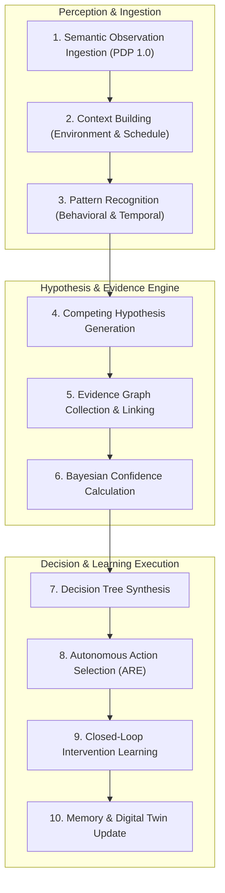
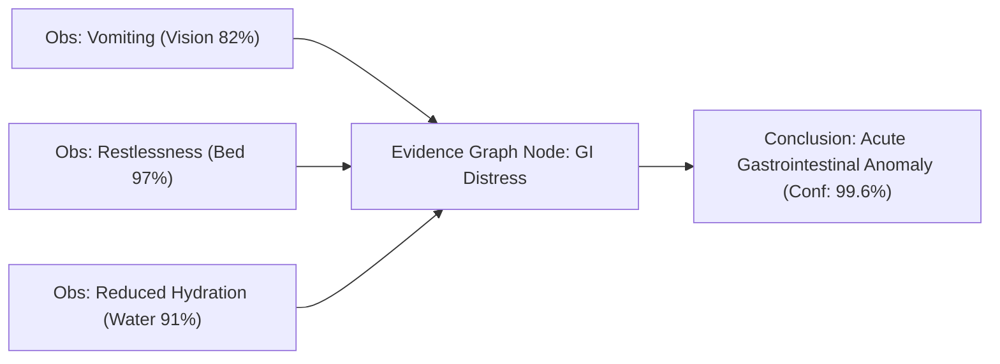

# 🧠 PO-0120 — COGNITIVE REASONING ENGINE (CRE) SPECIFICATION
**Version**: 1.0  
**Status**: Approved AI Research Specification  
**Authors**: AI Research Division, Cognitive Systems Group, Deep Learning & Veterinary AI Lab  
**Target Horizon**: 2026 – 2050  

---

## 1. EXECUTIVE SUMMARY

**PO-0120** specifies the **Cognitive Reasoning Engine (CRE)**, the cognitive neural core of the **Project One Brain**. The Brain is not a conversational chatbot or a wrapper around a single large language model (LLM). The Brain is an enterprise **Cognitive Operating System** designed to transform multi-modal semantic observations into understanding, understanding into decisions, and decisions into autonomous interventions.

The CRE operates strictly above the Hardware Abstraction Layer (HAL) and Pet Device Protocol (PDP 1.0). It never receives raw voltage signals, pixel buffers, or I2C registers; it ingests normalized semantic observations published over the **Companion Intelligence Mesh (CIM)** [PO-0110].

---

## 2. THE 10-STAGE REASONING PIPELINE



---

## 3. COMPETING HYPOTHESIS ENGINE

When anomalous telemetry is detected (e.g. `pet.food.reduced_intake`), the CRE instantiates multiple competing hypotheses $H_1, H_2, \dots, H_k$ simultaneously:

```
Observation: Reduced Appetite (Intake down 45%)
  ├── Hypothesis 1 (H1): Separation Anxiety / Psychological Stress
  ├── Hypothesis 2 (H2): Gastrointestinal Distress / Acute Illness
  ├── Hypothesis 3 (H3): Environmental Heat Stress (High Room Temp)
  └── Hypothesis 4 (H4): Routine Shift (Food served 2 hours late)
```

The CRE queries the **Evidence Graph** to calculate positive and negative evidence weights for each hypothesis until one candidate exceeds the decision threshold ($\theta_{\text{decision}} \ge 0.90$).

---

## 4. EVIDENCE GRAPH & REASONING TRACE

### 4.1 Evidence Graph
Every conclusion generated by the CRE maintains an explicit directed acyclic graph (DAG) linking the final inference to the underlying semantic observations:



### 4.2 Replayable Reasoning Trace
Every system notification or intervention is backed by a 100% replayable **Reasoning Trace** log accessible to guardians and licensed veterinarians:

```json
{
  "trace_id": "trace_99f1a2b",
  "timestamp": "2026-08-06T10:30:00Z",
  "pet_id": "pet_lola",
  "trigger_observation": "pet.anxiety.detected",
  "competing_hypotheses": [
    { "name": "separation_anxiety", "initial_conf": 0.65, "final_conf": 0.94 },
    { "name": "physical_pain", "initial_conf": 0.35, "final_conf": 0.12 }
  ],
  "reasoning_steps": [
    "Retrieved guardian presence state: Away from home (Context Cortex)",
    "Matched barking spectrum with past doorbell triggers (Audio Cortex)",
    "Calculated 432 Hz acoustic soothing efficacy score: 92% (Cognitive DNA)"
  ],
  "selected_action": "action.audio.play_calming",
  "outcome_verified": true
}
```

---

## 5. COMPANION COGNITIVE TIMELINE

Rather than storing disconnected event logs (`"Pet barked at 10:15"`), the CRE archives **Cognitive Stories** inside the companion's Digital Twin lifetime memory:

> *"At 10:15 AM, Lola exhibited elevated anxiety due to delivery noise outside. The CRE recognized separation stress, played 432 Hz soothing music, and restored Lola's resting heart rate to 68 BPM within 2.5 minutes."*

---

## 6. MULTI-STRATEGY REASONING MATRIX

1. **Rule-Based Reasoning**: Hard safety bounds (e.g. ambient temp $> 38^\circ\text{C} \implies$ immediate thermal alert).
2. **Probabilistic Reasoning**: Bayesian network confidence calculations across sparse sensor streams.
3. **Temporal Reasoning**: Analyzing daily/weekly circadian rhythms and routine drift over 90-day windows.
4. **Behavioral Reasoning**: Classifying play vs. aggression vs. lethargy using posture vectors.
5. **Predictive Reasoning**: Forewarning renal decline or arthritis stiffness 6–12 months prior to clinical onset.

---

## 7. 🔒 PATENT CANDIDATES PORTFOLIO

### 🔒 Patent Candidate PO-PAT-CRE-001
- **Title**: Competing Hypothesis Evaluation Engine for Multi-Modal Animal Telemetry.
- **Problem**: AI monitoring systems selecting single false-positive explanations for animal behavior without evaluating alternative hypotheses.
- **Innovation**: Instantiating parallel competing hypothesis trees linked to an evidence graph that dynamically accumulates weights from multi-modal semantic observers.
- **Claims**: A method for competing hypothesis evaluation in non-human animal biometric analysis.

### 🔒 Patent Candidate PO-PAT-CRE-002
- **Title**: Replayable Reasoning Trace Graph for Veterinary Diagnostic Verification.
- **Problem**: "Black box" AI models generating health alerts without verifiable causal lineage.
- **Innovation**: Generating an immutable directed acyclic graph (DAG) tracing every AI decision back to specific hardware observations for veterinary review.
- **Claims**: A system for generating replayable causal reasoning traces from bio-sensory streams.

### 🔒 Patent Candidate PO-PAT-CRE-003
- **Title**: Closed-Loop Reinforcement Learning System for Autonomous Behavioral Interventions.
- **Problem**: Static intervention rules failing to adapt when a pet becomes accustomed to specific calming sounds.
- **Innovation**: Updating individual Cognitive DNA efficacy scores based on 180-second post-intervention bio-feedback response loops.
- **Claims**: A method for reinforcement learning optimization of animal behavioral interventions.
