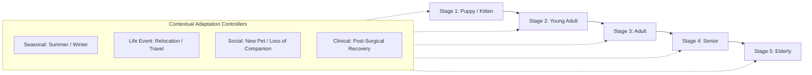
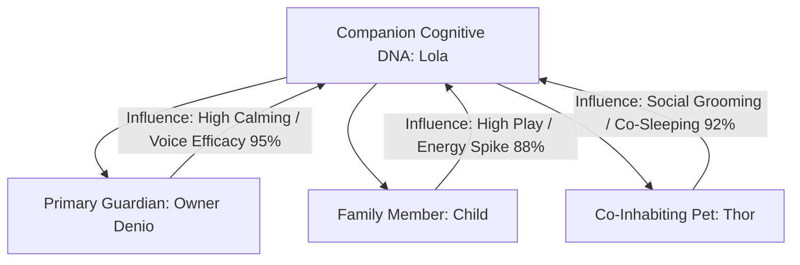

# 🧬 PO-0130 — COGNITIVE DNA SPECIFICATION
**Version**: 1.0  
**Status**: Approved AI Research Specification  
**Authors**: Cognitive Science Division, AI Research Team, Veterinary Intelligence & Behavioral Science Group  
**Target Horizon**: 2026 – 2050  

---

## 1. EXECUTIVE SUMMARY

**PO-0130** specifies **Cognitive DNA**, the lifelong living behavioral identity architecture of Project One. 

Cognitive DNA is not a static user profile or a simple machine learning classification label ("dog" or "golden retriever"). It is a dynamic, multi-dimensional, continuous behavioral genome that evolves throughout a companion animal's entire lifespan—from puppyhood through senior and elderly stages.

Every companion animal possesses exactly one persistent **Cognitive DNA** vector $\mathbf{G}(t)$ that integrates daily routines, resting heart rate baselines, sleep REM structures, spatial zone preferences, stress triggers, soothing acoustic sensitivities, and family relationship dynamics.

---

## 2. THE BEHAVIOR GENOME VECTOR $\mathbf{G}(t)$

The **Behavior Genome** is modeled as a multi-layered, 128-dimensional continuous vector space:

```
┌─────────────────────────────────────────────────────────────┐
│                 THE BEHAVIOR GENOME VECTOR G(t)             │
├─────────────────────────────────────────────────────────────┤
│  Dimensions 000-015: Physiological Baselines (HRV, BCG)    │
│  Dimensions 016-031: Circadian & Sleep Architecture        │
│  Dimensions 032-047: Nutrition & Hydration Kinematics      │
│  Dimensions 048-063: Spatial & Environmental Preferences   │
│  Dimensions 064-079: Stress & Anomaly Trigger Profiles     │
│  Dimensions 080-095: Intervention Efficacy Scores (432Hz)  │
│  Dimensions 096-111: Guardian & Social Relationship Graph  │
│  Dimensions 112-127: Life Stage & Aging Drift Factors      │
└─────────────────────────────────────────────────────────────┘
```

---

## 3. BEHAVIOR DRIFT METRIC

To detect subtle physiological or psychological decline (such as early feline cognitive dysfunction syndrome, canine osteoarthritis, or chronic pain), the Cognitive DNA continuously computes the **Behavior Drift Metric** $\Delta_{\text{drift}}(t)$:

$$\Delta_{\text{drift}}(t) = \|\mathbf{G}(t) - \mathbf{G}_{\text{baseline}}\|_2 = \sqrt{\sum_{i=1}^{128} \left( g_i(t) - g_i(\text{baseline}) \right)^2}$$

When $\Delta_{\text{drift}}(t) > \theta_{\text{drift}}$, the system triggers a **Reasoning Engine (CRE)** alert to investigate potential health or environmental causes.

---

## 4. LIFELONG LIFE STAGES & ADAPTIVE EVOLUTION

Behavior evolves naturally over a companion's life. History is **never overwritten**; every year contributes an immutable layer to the Cognitive DNA.



---

## 5. GUARDIAN RELATIONSHIP MODEL

The Cognitive DNA models how each individual human family member influences the animal:



---

## 6. EXPLAINABLE COGNITIVE LEARNING

Every modification to the Cognitive DNA vector generates a human-readable and veterinary-auditable explanation:

```json
{
  "dna_update_id": "dna_up_88a91b",
  "timestamp": "2026-08-06T10:33:00Z",
  "pet_id": "pet_lola",
  "dimension_modified": "dim_082_acoustic_soothing_efficacy",
  "previous_val": 0.84,
  "new_val": 0.92,
  "learning_source": {
    "observations": ["pet.anxiety.detected", "guardian.voice.played"],
    "response_time_seconds": 120,
    "confidence": 0.96
  },
  "rationale": "Lola's heart rate returned to 68 BPM within 2 mins of playing owner voice clip during thunderstorm."
}
```

---

## 7. 🔒 PATENT CANDIDATES PORTFOLIO

### 🔒 Patent Candidate PO-PAT-DNA-001
- **Title**: Multi-Dimensional Lifelong Behavior Genome Vector Architecture for Domestic Animals.
- **Problem**: Machine learning models classify animal behavior using static labels rather than continuous multi-dimensional temporal vectors.
- **Innovation**: A 128-dimensional continuous vector space encoding physiological, circadian, social, and intervention traits that evolve across animal life stages.
- **Claims**: A method for representing lifelong animal behavioral identity using continuous vector spaces.

### 🔒 Patent Candidate PO-PAT-DNA-002
- **Title**: Behavioral Drift Metric Calculation Engine for Early Veterinary Disease Forewarning.
- **Problem**: Gradual onset diseases (arthritic pain, renal decline) are missed because daily behavioral changes are small.
- **Innovation**: Measuring vector distance $\Delta_{\text{drift}}(t)$ between current behavioral genome state and multi-year historical baselines to predict chronic disease onset.
- **Claims**: A system for calculating behavioral vector drift to forewarn veterinary illness.

### 🔒 Patent Candidate PO-PAT-DNA-003
- **Title**: Adaptive Guardian Relationship Modeling & Social Influence Engine.
- **Problem**: AI systems treat all human household members identically, failing to account for individual attachment dynamics.
- **Innovation**: Quantifying individual human influence weights on animal heart rate and anxiety mitigation within a single household.
- **Claims**: A method for modeling individual human guardian influences on animal physiological baselines.
