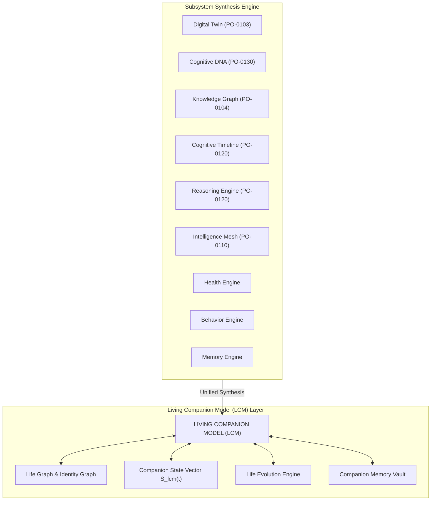
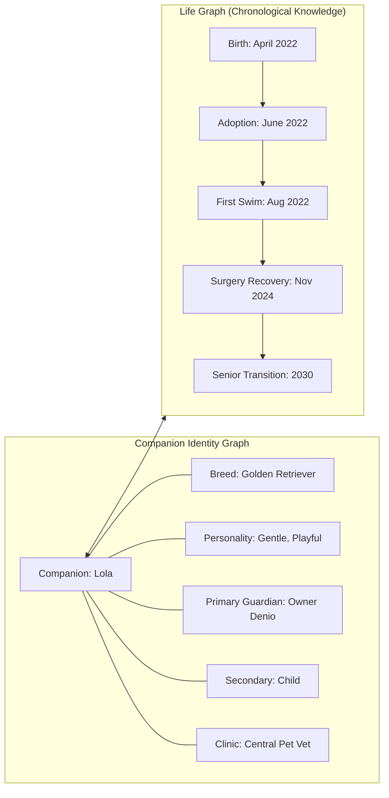

# 🌟 PO-0140 — LIVING COMPANION MODEL (LCM) SPECIFICATION
**Version**: 1.0  
**Status**: Approved Master Cognitive Specification  
**Authors**: Chief AI Scientist, Chief Enterprise Architect, Veterinary Intelligence Group, Knowledge Engineering & Cognitive Architecture Team  
**Target Horizon**: 2026 – 2050  

---

## 1. EXECUTIVE SUMMARY

**PO-0140** specifies the **Living Companion Model (LCM)**, the highest cognitive abstraction layer of the Project One platform.

The LCM is not a database. It is not a static profile. It is not merely a Digital Twin. The LCM is a living, multi-dimensional cognitive representation of a companion animal that continuously integrates behavior, health, memory, social relationships, physical environments, personality traits, routine shifts, and clinical evolution over an entire lifetime.

---

## 2. THE COMPANION STATE VECTOR $\mathbf{S}_{\text{lcm}}(t)$

The current multidimensional state of the companion animal is represented by the continuous **Companion State Vector** $\mathbf{S}_{\text{lcm}}(t)$:

$$\mathbf{S}_{\text{lcm}}(t) = \langle \mathbf{H}(t), \mathbf{B}(t), \mathbf{R}(t), \mathbf{E}(t), \mathbf{G}(t), \mathbf{P}(t) \rangle$$

Where:
- $\mathbf{H}(t)$: Vital physiological health state (BCG heart rate, respiration, HRV, weight, hydration).
- $\mathbf{B}(t)$: Current posture, activity level, and behavioral state machine output.
- $\mathbf{R}(t)$: Social relationship attachment weights across family members and co-inhabiting pets.
- $\mathbf{E}(t)$: Environmental state (zone location, ambient temperature, household schedule).
- $\mathbf{G}(t)$: 128-dimensional **Cognitive DNA** Behavior Genome vector [PO-0130].
- $\mathbf{P}(t)$: Predictive health risk vector (renopathy, osteoarthritis, cardiac risk 6–12 months out).

---

## 3. THE LIFE GRAPH & IDENTITY GRAPH

To answer *"Who the companion is"* rather than merely *"What happened"*, the LCM constructs two complementary graph topologies:

---

## 4. LIFE STAGE EVOLUTION & THE COMPANION MEMORY VAULT

### 4.1 Life Stage Progression
The **Life Evolution Engine** tracks the companion across seven discrete life stages:

$$\text{Birth} \longrightarrow \text{Puppy / Kitten} \longrightarrow \text{Young Adult} \longrightarrow \text{Adult} \longrightarrow \text{Senior} \longrightarrow \text{End of Life} \longrightarrow \text{Legacy Mode}$$

History is **never deleted**. Every life stage contributes an immutable layer to the Companion Memory Vault.

---

### 4.2 Legacy Mode & Ethical Memory Preservation
Upon a companion animal's passing, the LCM transitions into **Legacy Mode**:
- **Ethical Directive**: Legacy Mode preserves all memories, photos, videos, behavioral history, milestones, and health records for the guardian's lifetime.
- **Strict Prohibition**: The system **strictly forbids simulating that the pet is still alive** or generating synthetic conversational responses acting as the deceased pet.
- **Guardian Solace**: Enables guardians to view interactive timelines, milestone retrospectives, and behavioral memories with dignity.

---

## 5. EIGHT-TIER MEMORY SYSTEM

1. **Daily Memory**: Buffer of continuous 24-hour sensor telemetry.
2. **Weekly Memory**: Aggregated routine summaries and activity totals.
3. **Monthly Memory**: Circadian rhythms and weight trajectories.
4. **Lifetime Memory**: Permanent archive of major milestones, travels, and routine changes.
5. **Medical Memory**: Clinical vaccinations, surgeries, diagnostics, and medication schedules.
6. **Emotional Memory**: Calming factors, acoustic preferences, and panic triggers.
7. **Behavior Memory**: Habitual spatial zones, sleep postures, and play patterns.
8. **Relationship Memory**: Attachment scores and social interactions across family members.

---

## 6. EXPLAINABILITY FRAMEWORK

Every insight, risk warning, or recommendation produced by the LCM presents human-readable causal reasoning:

$$\text{Recommendation} \impliedby \Big( \text{Observations} \;\land\; \text{Historical Evidence} \;\land\; \text{Behavioral Evidence} \;\land\; \text{Environmental Context} \Big)$$

> *"Lola's activity level decreased by 30% over the past 3 days. Combining BCG sleep restlessness data (Smart Bed) and reduced gait velocity (Vision Device), the LCM suspects early hip stiffness following cold weather. Recommended veterinary evaluation."*

---

## 7. 🔒 PATENT CANDIDATES PORTFOLIO

### 🔒 Patent Candidate PO-PAT-LCM-001
- **Title**: Living Companion Model (LCM) Integrated Cognitive Architecture for Domestic Animal Lifespans.
- **Problem**: Disconnected IoT apps and databases storing fragmented health logs without a unified, evolving cognitive representation of animal identity.
- **Innovation**: A master cognitive model synthesizing Digital Twins, Cognitive DNA, Knowledge Graphs, and Multi-Tier Memory into a unified, lifelong Companion State Vector.
- **Claims**: An integrated cognitive model architecture for lifelong animal representation.

### 🔒 Patent Candidate PO-PAT-LCM-002
- **Title**: Life Graph & Companion Identity Graph Architecture for Non-Human Animals.
- **Problem**: Relational databases recording historical event timestamps without representing an animal's unique social identity, relationships, and spatial personality.
- **Innovation**: Dual-graph topology combining a temporal Life Graph of milestones with a semantic Companion Identity Graph representing social attachment and behavioral traits.
- **Claims**: A dual-graph system for representing companion animal life history and identity.

### 🔒 Patent Candidate PO-PAT-LCM-003
- **Title**: Ethical Legacy Mode Memory Preservation System for Deceased Companion Animals.
- **Problem**: Unethical digital resurrection of deceased pets via conversational LLM simulation causing emotional distress to grieving owners.
- **Innovation**: An ethical memory vault transition that freezes real-time simulation while preserving immutable historical behavioral memories, health records, and milestone timelines for guardian solace.
- **Claims**: A method for ethical post-mortem memory preservation of companion animal digital models.
