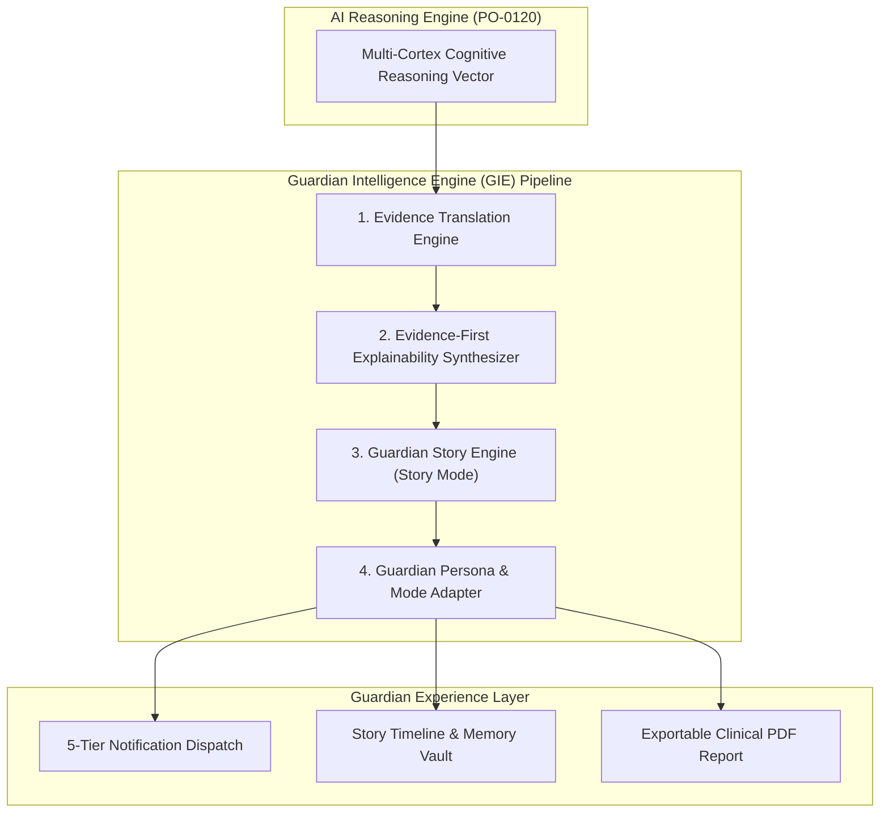
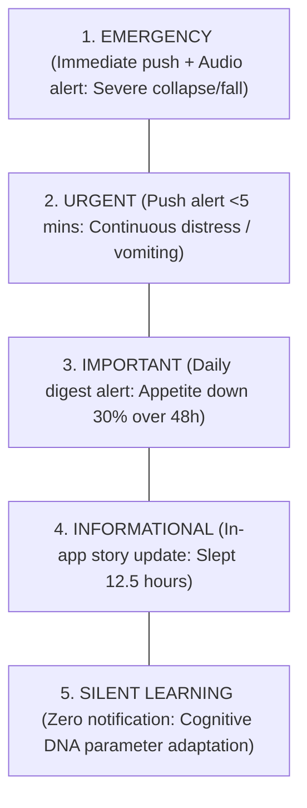

# 💬 PO-0150 — GUARDIAN INTELLIGENCE ENGINE (GIE) SPECIFICATION
**Version**: 1.0  
**Status**: Approved Human-Centered AI Specification  
**Authors**: Human-Centered AI Division, UX Research Team, Cognitive Architecture Group, Veterinary Advisory Council  
**Target Horizon**: 2026 – 2050  

---

## 1. EXECUTIVE SUMMARY

**PO-0150** specifies the **Guardian Intelligence Engine (GIE)**, the human-centric communication and explainability layer of Project One.

The GIE is not a customer support chatbot or an unguided Large Language Model (LLM). It is the cognitive translation subsystem that transforms complex multi-modal AI reasoning vectors [PO-0120], Cognitive DNA baselines [PO-0130], and Living Companion Model states [PO-0140] into empathetic, transparent, zero-panic communication for human guardians.



---

## 2. COMMUNICATION PRINCIPLES & GUARDIAN MODES

### 2.1 Immutable Communication Principles
1. **Never Create Panic**: Alarmist notifications are forbidden. All communications present calm, structured observations.
2. **Never Exaggerate**: System observations reflect statistical probabilities, never definitive medical diagnoses.
3. **Always Explain Uncertainty**: Express confidence bounds explicitly ($C_{\text{fused}} = 92\%$).
4. **Recommend Veterinary Consultation**: When risk thresholds are breached, prompt professional veterinary evaluation.

### 2.2 Guardian Experience Modes

| Mode | Target User Persona | Detail Level | Interface Presentation |
| :--- | :--- | :--- | :--- |
| **Minimal Mode** | Busy Professional / Family | High-level summary | Simple peace of mind status ("Lola is OK") |
| **Standard Mode** | General Companion Guardian | Story & Timeline | Daily story highlights & key activity rings |
| **Detailed Mode** | Experienced Guardian / Breeder | Deep metrics | Detailed sleep REM graphs, BCG trends, intake ml |
| **Veterinary Mode** | Licensed Veterinarians | Clinical grade | Evidence Graphs, raw ECG/BCG waveforms, PDF export |
| **Research Mode** | Animal Scientists / Labs | Raw data vector | Anonymized 128-D Behavior Genome vectors |

---

## 3. NOTIFICATION TIERING STRATEGY



---

## 4. GUARDIAN STORY ENGINE (STORY MODE)

Rather than presenting raw IoT telemetry logs (`"Motion detected at 14:30. Barking 74dB"`), the GIE generates understandable human stories:

> **Story Mode Output**:  
> *"Today Lola spent most of the afternoon sleeping peacefully in the living room. Around 2:30 PM, she showed signs of anxiety near the front door due to neighborhood construction noise. The system automatically played your recorded voice clip, and she calmed down within two minutes. Based on 90-day observations, this voice intervention continues to be 94% effective."*

---

## 5. EVIDENCE-FIRST EXPLAINABILITY FRAMEWORK

Every recommendation presented by the GIE strictly enforces a 6-part explainability structure:

```json
{
  "recommendation_id": "rec_90f1a2b",
  "what_happened": "Lola's daily water consumption decreased by 40% over the last 48 hours.",
  "why": "BCG sleep sensors detected elevated resting body temp (+0.6°C) combined with reduced drinking frequency.",
  "confidence": 0.94,
  "historical_comparison": "Compared to Lola's 90-day baseline of 480ml/day, current intake is 280ml/day.",
  "evidence": ["pdp.v1.telemetry.water_intake", "pdp.v1.telemetry.smart_bed_temp"],
  "recommended_next_step": "Offer fresh cool water. If intake remains low for 12 hours, schedule a vet checkup."
}
```

---

## 6. COMPANION MEMORY GENERATOR

The GIE automatically curates lifelong companion memories archived in the **Companion Memory Vault**:
- **Daily Memories**: Auto-generated 15-second video/story clip of the day's happiest moment.
- **Weekly Highlights**: Play time duration, favorite sleeping spots, social interactions.
- **Monthly Moments**: Weight trajectory, sleep efficiency ring metrics, health score trends.
- **Year in Review**: Annual companion milestone film and behavioral evolution retrospective.

---

## 7. 🔒 PATENT CANDIDATES PORTFOLIO

### 🔒 Patent Candidate PO-PAT-GIE-001
- **Title**: Guardian Story Engine for Synthesizing Natural Human Narratives from Multi-Modal Sensor Telemetry.
- **Problem**: Traditional smart home apps present raw notification lists that cause user fatigue or anxiety.
- **Innovation**: A natural language story generation engine that translates multi-modal telemetry events into empathetic, contextual daily narratives.
- **Claims**: A system for converting raw bio-sensor events into human story narratives.

### 🔒 Patent Candidate PO-PAT-GIE-002
- **Title**: Evidence-First Explainable AI Framework for Veterinary Telemetry Recommendations.
- **Problem**: AI recommendations presented without underlying evidence cause distrust among pet guardians and veterinarians.
- **Innovation**: Structuring every AI health recommendation with mandatory 6-part evidence lineage tracing back to physical sensor observations.
- **Claims**: A method for evidence-first explainable AI output generation in animal health monitoring.

### 🔒 Patent Candidate PO-PAT-GIE-003
- **Title**: Context-Aware Multi-Tier Notification Router with Adaptive Guardian Mode Profiling.
- **Problem**: Uniform notification rules spam users with non-critical alerts or fail to adapt to veterinarian vs. casual guardian roles.
- **Innovation**: A 5-tier notification router that adjusts dispatch channels dynamically based on user persona profiles and fused AI confidence scores.
- **Claims**: A multi-tier notification router for companion animal telemetry systems.
