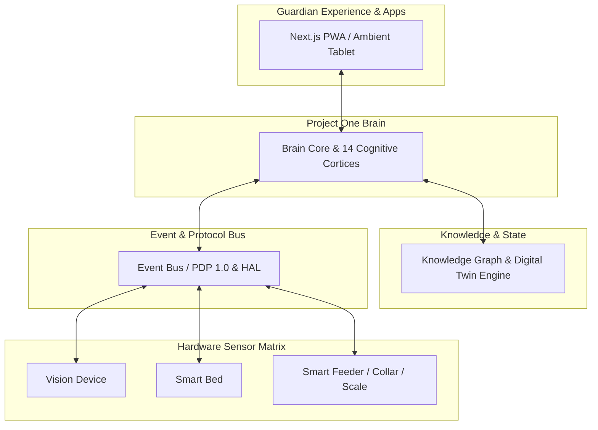

# 🏛️ PO-0100 — ENTERPRISE ARCHITECTURE SPECIFICATION
**Version**: 1.0  
**Status**: Approved Architecture Directive  
**Classification**: Enterprise Technical Standard  
**Target Horizon**: 2026 – 2050  

---

## 1. EXECUTIVE SUMMARY

**PO-0100** defines the master enterprise architecture blueprint for **Project One**, a global Companion Intelligence Platform. Project One is engineered to support millions of companion animals, hundreds of millions of daily telemetric events, heterogenous hardware sensor nodes, and multi-modal AI cognitive inference models over a 20+ year horizon.

The enterprise architecture enforces a strict 9-layer system stack:
$$\text{Guardian Experience} \to \text{Applications} \to \text{Brain} \to \text{Cognitive Architecture} \to \text{Knowledge Graph} \to \text{Digital Twin} \to \text{Event Bus} \to \text{Protocols} \to \text{Devices}$$

Hardware devices are completely decoupled from business logic through the Hardware Abstraction Layer (HAL). All communication is event-driven via the **Pet Device Protocol (PDP 1.0)** using **Pet Description Language (PDL)** biological data structures.

---

## 2. BUSINESS CONTEXT

Project One is not a camera brand, an IoT gadget platform, or a reactive security system. It is a long-term platform business creating a persistent digital twin and cognitive guardian for companion animals. The business model combines hardware sensor sales, recurring cloud AI subscriptions, veterinary diagnostic analytics, and third-party developer ecosystem monetization.

---

## 3. PROBLEM STATEMENT

Existing consumer pet technologies suffer from:
1. **Surveillance Noise**: Blind motion sensors issuing false panic alerts.
2. **Siloed Hardware**: Cameras, smart feeders, and collars operating in disconnected data silos.
3. **Short Product Lifespans**: Proprietary consumer gadgets becoming obsolete in 2–3 years.
4. **Lack of Biometric Context**: Inability to correlate continuous behavioral patterns (sleep, hydration, gait) with long-term veterinary health outcomes.

---

## 4. ARCHITECTURE GOALS

1. **Global Scale**: Support 10M+ active pets and 100M+ events/day across multi-region cloud deployments.
2. **Multi-Decade Longevity**: Ensure 20+ year non-breaking backward compatibility for protocols and digital twin models.
3. **Sub-Second Event Processing**: Edge classification $<50\text{ms}$; Cloud event routing $<150\text{ms}$.
4. **Zero-Trust Security**: Multi-tenant isolation at the database kernel via PostgreSQL Row Level Security (RLS).

---

## 5. DESIGN PRINCIPLES

1. Platform before product.
2. Events before data.
3. Interfaces before hardware.
4. AI before automation.
5. Everything explainable and observable.
6. Security and privacy by design.

---

## 6. FUNCTIONAL REQUIREMENTS

- **FR-01**: Ingest telemetry from Vision Devices, Smart Beds, Collars, Feeders, and Scales.
- **FR-02**: Orchestrate 14 cognitive cortices in real-time.
- **FR-03**: Maintain persistent Digital Twins and Cognitive DNA baselines.
- **FR-04**: Execute autonomous stepped behavioral interventions.

---

## 7. NON-FUNCTIONAL REQUIREMENTS

- **NFR-01 (Availability)**: $99.99\%$ uptime for global cloud event bus.
- **NFR-02 (Latency)**: End-to-end event-to-action dispatch $<300\text{ms}$.
- **NFR-03 (Security)**: TLS 1.3 in transit, AES-256 at rest, PostgreSQL RLS tenant isolation.

---

## 8. CORE COMPONENTS & MERMAID ARCHITECTURE DIAGRAM

---

## 9. INTERFACES & DATA FLOW

- **Device to Cloud**: PDP 1.0 over WebSockets / MQTT / WebRTC.
- **Cloud to AI Brain**: Internal Event Bus (Apache Kafka / NATS / Redis Streams).
- **Brain to Guardian App**: GraphQL / REST / Server-Sent Events (SSE).

---

## 10. EVENT FLOW

1. **Sensor Ingestion**: Smart Bed detects BCG heart rate variation ($85\text{ bpm}$).
2. **PDP Encoding**: Payload wrapped in PDL schema and published to Event Bus.
3. **Brain Routing**: Sensor & Health Cortices evaluate telemetry against pet's Cognitive DNA baseline.
4. **Autonomous Action**: Action Cortex triggers local AI Station to play relaxing soundscape.
5. **Digital Twin Update**: State machine appends record to lifetime memory tier.

---

## 11. SECURITY & PRIVACY

- Multi-tenant data segregation enforced by PostgreSQL RLS (`get_user_org_id()`).
- Zero raw video stored in cloud without explicit opt-in; edge devices perform local feature extraction.

---

## 12. SCALABILITY, OBSERVABILITY & MONITORING

- Horizontal scaling via Kubernetes / Edge serverless functions.
- OpenTelemetry tracing across all 14 Cortices.
- Prometheus & Grafana real-time telemetry dashboards.

---

## 13. FAILURE RECOVERY & FUTURE EVOLUTION

- Edge devices cache events locally during cloud connection loss and sync upon reconnection.
- Backward-compatible PDP protocol versioning ensures legacy hardware operates through 2050.

---

## 14. 🔒 PATENT CANDIDATE PO-PAT-000

- **Title**: Multi-Layer Event-Driven Hardware Abstraction Architecture for Companion Animal Digital Twins.
- **Problem**: Inability of IoT platforms to abstract multi-vendor pet hardware into unified cognitive models.
- **Innovation**: A hardware abstraction layer (HAL) translating heterogenous physical signals into standardized biological event streams (PDL) for real-time digital twin synthesis.
- **Claims**: A method for processing multi-modal edge sensory signals through standardized semantic event transformation.

---

## 15. ADR & RFC REFERENCES
- **ADR-001**: Selection of Event-Driven Microservices Architecture.
- **RFC-001**: PDP 1.0 Wire Protocol Specification.

---

## 16. GLOSSARY & REFERENCES
- **HAL**: Hardware Abstraction Layer.
- **PDP**: Pet Device Protocol.
- **PDL**: Pet Description Language.
