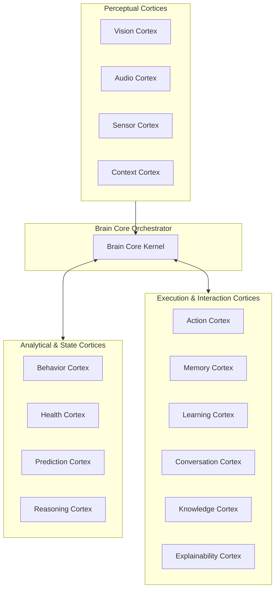

# 🧠 PO-0101 — COMPANION COGNITIVE ARCHITECTURE SPECIFICATION
**Version**: 1.0  
**Status**: Approved Cognitive Directive  
**Classification**: Enterprise Technical Standard  

---

## 1. EXECUTIVE SUMMARY

**PO-0101** defines the **Companion Cognitive Architecture (CCA)** of Project One. The CCA is an asynchronous, multi-cortex neural intelligence engine. Rather than relying on a single monolith LLM, the architecture decomposes cognitive reasoning into fourteen specialized, independent **Cognitive Cortices** coordinated by **Brain Core**.

---

## 2. THE 14 INDEPENDENT COGNITIVE CORTICES

### Detailed Cortices Definition:
1. **Brain Core**: Asynchronous message orchestrator and priority task scheduler.
2. **Vision Cortex**: Optical keypoint posture tracking, spatial localization, identity embedding.
3. **Audio Cortex**: Acoustic decibel tracking, vocalization spectrum classification (bark, whine, meow).
4. **Sensor Cortex**: Smart bed BCG vitals (heart rate, respiration), weight load cell data.
5. **Context Cortex**: Environmental weather, room ambient lighting, household schedule context.
6. **Behavior Cortex**: Temporal state machines, routine drift detection, play vs. stress classification.
7. **Health Cortex**: Daily vitality score calculations, caloric balance, hydration tracking.
8. **Prediction Cortex**: Long-term risk forecasting (early gait limping, renal disease risk).
9. **Reasoning Cortex**: Multi-modal data fusion and risk assessment decision tree execution.
10. **Action Cortex**: Autonomous intervention dispatch (calming audio, owner voice playback).
11. **Memory Cortex**: Tiered temporal memory manager (Short, Daily, Behavior, Lifetime).
12. **Learning Cortex**: Continuous reinforcement learning for Cognitive DNA parameter refinement.
13. **Conversation Cortex**: Natural language query engine for human guardian interactions.
14. **Knowledge Cortex**: Veterinary clinical domain graph and breed biological baselines.
15. **Explainability Cortex**: Causal lineage and rationale generation for every event.

---

## 3. DATA & EVENT FLOW

1. Perceptual Cortices (Vision, Audio, Sensor) emit raw feature tokens to Event Bus.
2. Brain Core routes tokens to Behavior & Health Cortices.
3. Reasoning Cortex evaluates current state against persistent Digital Twin baselines.
4. If intervention is required, Action Cortex executes stepped autonomous response.
5. Explainability Cortex constructs human-readable story log.

---

## 4. 🔒 PATENT CANDIDATE PO-PAT-0101

- **Title**: Multi-Cortex Asynchronous Cognitive Ensemble Architecture for Animal Behavior & Biometric Analysis.
- **Problem**: Monolithic neural networks fail at real-time heterogeneous sensory fusion (BCG + optical keypoints + audio spectrums).
- **Innovation**: Modular cognitive cortices operating as independent micro-services communicating via standardized semantic event frames.
- **Claims**: A method for asynchronous multi-cortex sensor fusion in companion animal telemetry.

---

## 5. GLOSSARY & REFERENCES
- **CCA**: Companion Cognitive Architecture.
- **Cortex**: Independent cognitive microservice unit within the Brain.
