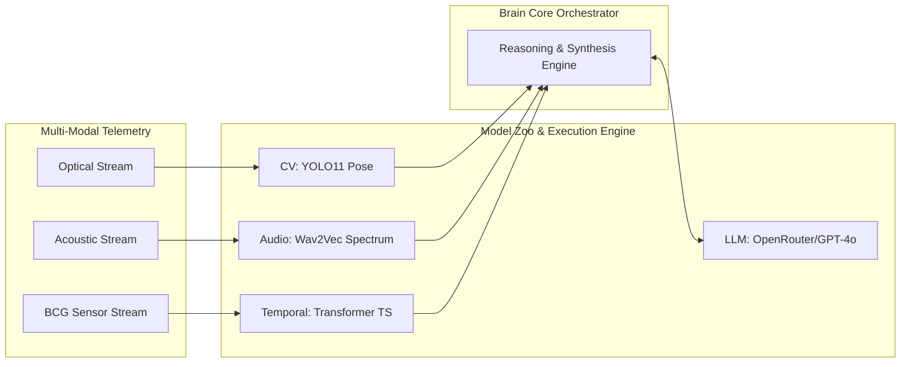

# 🧠 PO-0102 — PROJECT ONE BRAIN SPECIFICATION
**Version**: 1.0  
**Status**: Approved Architecture Directive  
**Classification**: Enterprise Technical Standard  

---

## 1. EXECUTIVE SUMMARY

**PO-0102** specifies the **Project One Brain** model orchestration engine. The Brain never relies on a single monolithic LLM. It orchestrates a heterogenous multi-model pipeline: Computer Vision (YOLO/PoseNet), Audio Spectrogram Models, Temporal Time-Series Classifiers, Graph Neural Networks (GNNs), and Large Language Models (LLMs) via OpenRouter / OpenAI.

---

## 2. MULTI-MODEL ORCHESTRATION PIPELINE

### Model Classification Matrix:
- **Vision Models**: YOLO11, PoseNet, ResNet (Posture, gait, spatial keypoints).
- **Audio Models**: YAMNet, Wav2Vec2 (Vocalization, distress spectrums).
- **Temporal Models**: TimesNet, PatchTST (Sleep, hydration, heart rate anomalies).
- **Language Models**: GPT-4o, Claude 3.5 Sonnet (Conversational interface, veterinary summary generation).

---

## 3. 🔒 PATENT CANDIDATE PO-PAT-0102

- **Title**: Dynamic Fallback & Consensus Orchestration System for Heterogeneous Multi-Modal Animal Telemetry Models.
- **Problem**: Individual AI models produce false positives when evaluating isolated sensory inputs (e.g. optical mistaking lying down for collapse).
- **Innovation**: Consensus-weighted multi-model scoring engine combining optical pose, BCG heart rate, and acoustic decibels to validate pet state before intervention.
- **Claims**: A system for cross-modal verification of animal physiological distress.
