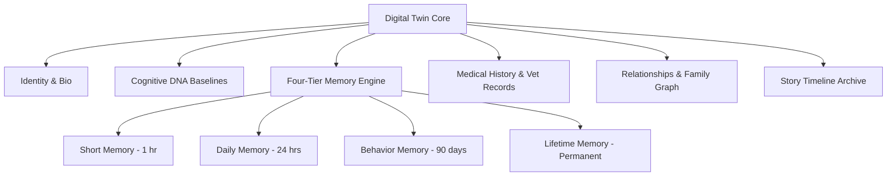

# 🐕 PO-0103 — DIGITAL TWIN SPECIFICATION
**Version**: 1.0  
**Status**: Approved Architecture Directive  
**Classification**: Enterprise Technical Standard  

---

## 1. EXECUTIVE SUMMARY

**PO-0103** defines the persistent **Digital Twin** framework. Each companion animal owns exactly one persistent Digital Twin that integrates identity, physical metrics, medical records, daily routine, family relationships, four-tier digital memory, and individualized **Cognitive DNA**.

---

## 2. DIGITAL TWIN DATA STRUCTURE

### Digital Twin Properties:
1. **Identity & Bio**: Species, breed, sex, sterilisation status, birth date, weight trajectory.
2. **Cognitive DNA**: Sleep duration target, resting HR, water intake ml/day, anxiety decibel triggers, favorite zones.
3. **Medical History**: Vaccinations, past surgeries, allergy profiles, medication schedules.
4. **Family & Relationships**: Primary guardian, family members, co-inhabiting pets.
5. **Timeline**: Immutable chronological story stream.

---

## 3. 🔒 PATENT CANDIDATE PO-PAT-0103

- **Title**: Continuous Physiological & Behavioral Digital Twin State Vector Representation for Non-Human Companions.
- **Problem**: Traditional pet profile applications store static metadata rather than continuous dynamic physiological state vectors.
- **Innovation**: A real-time updating multi-dimensional state vector reflecting physiological baselines and temporal memory tiers.
- **Claims**: A method for constructing a dynamic cognitive digital twin of a domestic animal.
