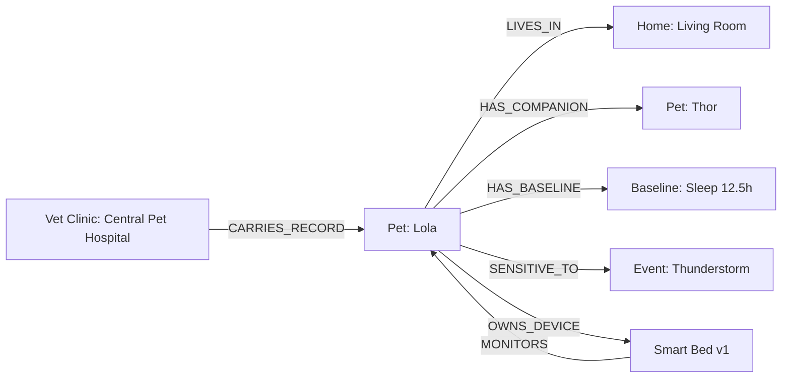

# 🕸️ PO-0104 — KNOWLEDGE GRAPH SPECIFICATION
**Version**: 1.0  
**Status**: Approved Architecture Directive  
**Classification**: Enterprise Technical Standard  

---

## 1. EXECUTIVE SUMMARY

**PO-0104** details the **Project One Knowledge Graph (POKG)**. To model complex real-world relationships—such as animal-to-zone preferences, multi-pet interactions, seasonal behavior changes, and breed-specific clinical vulnerabilities—Project One utilizes a Knowledge Graph instead of static relational schemas.

---

## 2. KNOWLEDGE GRAPH SCHEMA & MERMAID DIAGRAM

### Core Entity Node Types:
- `Pet`, `Guardian`, `FamilyMember`, `Home`, `RoomZone`, `Device`, `Event`, `BehaviorBaseline`, `VeterinaryClinic`, `ClinicalCondition`.

### Edge Relationship Types:
- `MONITORS`, `EXHIBITS_BEHAVIOR`, `TRIGGERS_ANXIETY`, `LOCATED_IN`, `CO_INHABITS_WITH`, `DIAGNOSED_WITH`.

---

## 3. 🔒 PATENT CANDIDATE PO-PAT-0104

- **Title**: Semantic Knowledge Graph System for Cross-Domain Animal Biometric & Behavioral Relationship Modeling.
- **Problem**: Relational databases cannot represent complex, dynamic multi-entity behavioral interactions between pets, rooms, environmental triggers, and clinical conditions.
- **Innovation**: Graph-based semantic representation of animal life context coupled with graph neural network (GNN) link prediction for proactive health alerts.
- **Claims**: A knowledge graph architecture for modeling domestic companion animal telemetry and environmental relationships.
