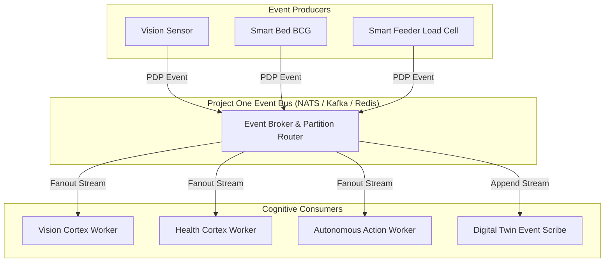

# ⚡ PO-0105 — EVENT BUS SPECIFICATION
**Version**: 1.0  
**Status**: Approved Architecture Directive  
**Classification**: Enterprise Technical Standard  

---

## 1. EXECUTIVE SUMMARY

**PO-0105** specifies the **Project One Event Bus (POEB)**. Everything in Project One is event-driven. Direct component-to-component synchronous API calls between systems are strictly prohibited. All perceptual inputs, cognitive inferences, autonomous actions, and digital twin mutations are published as immutable events over the Event Bus.

---

## 2. EVENT-DRIVEN TOPOLOGY & MERMAID FLOW



### Event Message Envelope Standard (PDP 1.0):
```json
{
  "event_id": "evt_90f1a2b",
  "topic": "pdp.v1.telemetry.eating",
  "org_id": "org_77a2",
  "device_id": "cam_8f42",
  "pet_id": "pet_lola",
  "timestamp_utc": "2026-08-05T10:20:00.000Z",
  "payload": {
    "event_type": "eating",
    "severity": "info",
    "confidence": 0.98,
    "duration_s": 420,
    "metrics": { "intake_grams": 220 }
  }
}
```

---

## 3. 🔒 PATENT CANDIDATE PO-PAT-0105

- **Title**: High-Throughput Sub-Second Event Partitioning & Contextual Fanout Broker for Multi-Modal Pet Telemetry.
- **Problem**: Traditional message queues choke on high-frequency streaming optical keypoint data combined with low-frequency discrete health events.
- **Innovation**: Contextual partition router using pet ID hashing and event severity tiering to prioritize critical health alerts over continuous pose streams.
- **Claims**: A method for real-time event partitioning in multi-modal pet telemetric streams.
