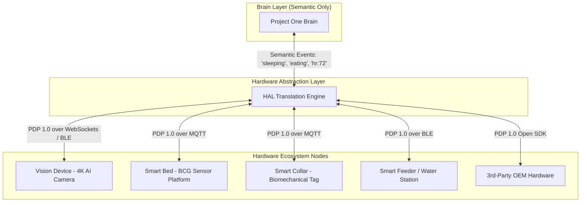

# 🏠 PO-0106 — DEVICE HUB & HARDWARE ABSTRACTION SPECIFICATION
**Version**: 1.0  
**Status**: Approved Architecture Directive  
**Classification**: Enterprise Technical Standard  

---

## 1. EXECUTIVE SUMMARY

**PO-0106** specifies the **Universal Device Hub** and **Hardware Abstraction Layer (HAL)**. The Brain must never know hardware brand names, firmware versions, or pin configurations. The Device Hub abstracts all physical hardware nodes into semantic event streams.

---

## 2. HARDWARE ABSTRACTION LAYER (HAL) ARCHITECTURE

---

## 3. ZERO-CONFIGURATION ONBOARDING PROTOCOL

1. **Step 1 (Scan)**: User scans camera/device QR code via PWA.
2. **Step 2 (BLE Handshake)**: Mobile PWA pairs via Web Bluetooth to send WiFi credentials.
3. **Step 3 (PDP Verification)**: Device sends self-describing **PDL** schema token to cloud.
4. **Step 4 (Provisioned)**: Device registered under org ID in $<2\text{ minutes}$.

---

## 4. 🔒 PATENT CANDIDATE PO-PAT-0106

- **Title**: Self-Describing Semantic Hardware Abstraction Protocol for Companion Animal Sensory Nodes.
- **Problem**: Proprietary IoT ecosystems require custom driver development for every new sensor model.
- **Innovation**: A self-describing biological capabilities protocol (PDL) enabling zero-driver integration of novel animal biometric sensors.
- **Claims**: A method for abstracting multi-vendor animal sensors into semantic event schemas.
