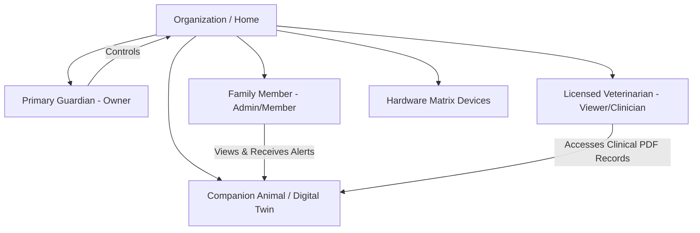

# 🔐 PO-0107 — IDENTITY PLATFORM & RBAC SPECIFICATION
**Version**: 1.0  
**Status**: Approved Architecture Directive  
**Classification**: Enterprise Technical Standard  

---

## 1. EXECUTIVE SUMMARY

**PO-0107** defines the **Project One Identity Platform**. Identity encompasses guardians, family members, veterinarians, devices, homes, and organizations. Access control is enforced via granular Role-Based Access Control (RBAC) and PostgreSQL Row Level Security (RLS).

---

## 2. IDENTITY RELATIONSHIP GRAPH



---

## 3. ROW LEVEL SECURITY & POLICY MATRIX

Every PostgreSQL database query evaluates `get_user_org_id() = org_id`.

```sql
create policy "Users can access pets in their org"
  on public.pets for all
  using (org_id = public.get_user_org_id());
```

---

## 4. 🔒 PATENT CANDIDATE PO-PAT-0107

- **Title**: Multi-Tenant Cryptographic Identity & Context-Aware Access Control for Animal Health Telemetry.
- **Problem**: Inability to grant temporary, time-bound clinical telemetry access to external veterinarians without compromising private household video feeds.
- **Innovation**: Dual-token role isolation allowing clinical vet access restricted strictly to physiological health metrics while blacking out domestic video streams.
- **Claims**: A method for context-segregated telemetry access control in domestic animal monitoring.
