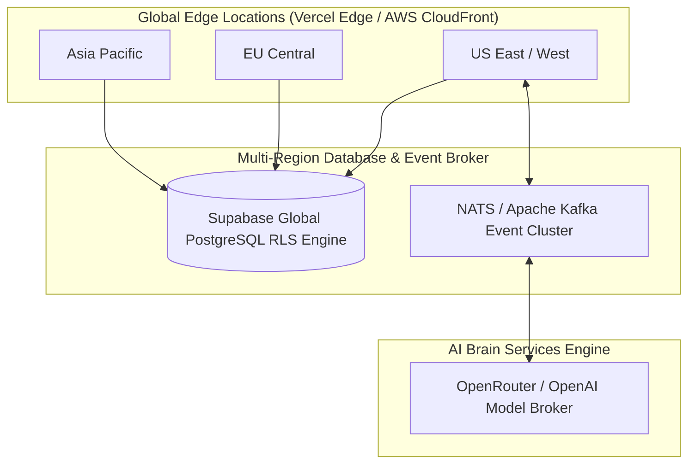

# ☁️ PO-0108 — CLOUD PLATFORM SPECIFICATION
**Version**: 1.0  
**Status**: Approved Architecture Directive  
**Classification**: Enterprise Technical Standard  

---

## 1. EXECUTIVE SUMMARY

**PO-0108** specifies the **Project One Cloud Platform**. The cloud platform operates across multi-region serverless clusters (Vercel Edge, AWS, Supabase PostgreSQL), providing global real-time event routing, offline edge device synchronization, Over-The-Air (OTA) firmware management, and OpenTelemetry observability.

---

## 2. MULTI-REGION CLOUD INFRASTRUCTURE

---

## 3. OFFLINE SYNCHRONIZATION & OTA PROTOCOL

- Edge devices (Vision Devices, Smart Beds) maintain a local SQLite buffer.
- During cloud disconnects, telemetry events are cached locally.
- Upon reconnection, events are backfilled into the cloud Event Bus with original client timestamps.
- OTA updates use encrypted dual-bank A/B firmware partitions for zero-downtime updates.

---

## 4. 🔒 PATENT CANDIDATE PO-PAT-0108

- **Title**: Asynchronous Offline Synchronization & Delta Reconciliation System for High-Frequency Biometric Sensor Nodes.
- **Problem**: Loss of internet connectivity causes gaps in health metrics and digital twin state continuity.
- **Innovation**: A client-side delta reconciliation algorithm that backfills continuous BCG heart rate and sleep posture intervals into cloud state vectors without duplicate event creation.
- **Claims**: A method for offline telemetry buffering and chronological delta backfilling in animal monitoring systems.
