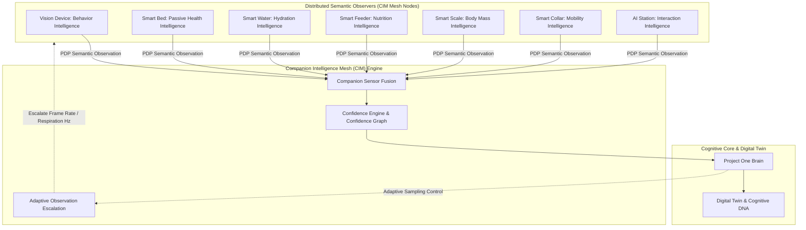

# 🕸️ PO-0110 — COMPANION INTELLIGENCE MESH (CIM) SPECIFICATION
**Version**: 1.0  
**Status**: Approved Master Architectural Directive (ACR-0001)  
**Classification**: Core Enterprise Architectural Pillar  
**Target Horizon**: 2026 – 2050  

---

## 1. EXECUTIVE SUMMARY & ARCHITECTURAL MOTIVATION

**PO-0110** specifies the **Companion Intelligence Mesh (CIM)**, a foundational architectural pillar of Project One. 

During hardware design, a fundamental discovery was formalized: **No Project One device is an isolated product.** The Vision Device, Smart Bed, Smart Water Fountain, Smart Feeder, Smart Scale, and Smart Collar are not standalone gadgets; they are distributed, specialized sensory observers within a unified cognitive mesh.

Intelligence does not exist inside any single physical device. Intelligence **emerges** from the real-time cross-correlation of partial semantic observations across the Companion Intelligence Mesh.



---

## 2. CORE MESH CONCEPTS & MATRIX

### 2.1 Distributed Observation
Each physical device observes only a specific slice of reality. No single device understands the total state of the animal. Devices publish independent semantic observations over the **Event Bus**; the **Project One Brain** correlates these streams into unified companion intelligence.

| Device Node | Subsystem Specialized Role | Primary Semantic Observations Emitted |
| :--- | :--- | :--- |
| **Vision Device** | Behavior Intelligence | Posture, play, gait limping, vomiting, spatial zones |
| **Smart Bed** | Passive Health Intelligence | Resting HR (BCG), respiration rate, sleep REM, stiffness |
| **Smart Water** | Hydration Intelligence | Water intake volume ($\text{ml}$), drinking frequency |
| **Smart Feeder** | Nutrition Intelligence | Caloric intake ($\text{g}$), eating velocity, missed meals |
| **Smart Scale** | Body Mass Intelligence | Static & dynamic weight trajectory, body composition |
| **Smart Collar** | Mobility Intelligence | Daily step counts, GPS location, outdoor kinematics |
| **AI Station** | Interaction Intelligence | Ambient presence, vocalization decibels, guardian voice |
| **Cloud Platform** | Collective Intelligence | Anonymized population baselines & epidemiological models |
| **Project One Brain** | Reasoning Intelligence | Multi-modal correlation, risk synthesis, ARE intervention |

---

### 2.2 Companion Sensor Fusion
Unlike traditional sensor fusion (which combines raw sensor signals like I2C voltage or accelerometer data), **Companion Sensor Fusion** combines high-level semantic understanding across disparate domains.

```
Vision Device (Detects Vomiting: 82% Conf)
   + Smart Bed (Detects Restlessness & Elevated HR: 97% Conf)
   + Smart Water (Detects Reduced Hydration Intake: 91% Conf)
   + Smart Feeder (Detects Reduced Appetite: 94% Conf)
   ===========================================================
   ===> CIM FUSED DIAGNOSTIC PATTERN: Gastrointestinal Distress (Combined Confidence: 99.6%)
```

---

### 2.3 Confidence Engine & Observation Confidence Graph
Every semantic observation emitted by a mesh node carries a localized confidence score $C_i \in [0.0, 1.0]$. The **Confidence Engine** propagates confidence across the **Observation Confidence Graph** using joint Bayesian probabilities:

$$P(\text{Health State} | O_1, O_2, \dots, O_n) = 1 - \prod_{i=1}^{n} (1 - w_i \cdot C_i)$$

Where $w_i$ represents the contextual weight of observer $i$ for a given diagnostic domain.

---

### 2.4 Adaptive Observation Protocol
When fused confidence indicates an anomaly or high uncertainty ($C_{\text{fused}} < \theta_{\text{certainty}}$), the Brain commands **Adaptive Observation**:
1. **Vision Device**: Elevate camera analysis from 5 FPS motion sub-sampling to 30 FPS full 4K pose keypoint extraction.
2. **Smart Bed**: Increase BCG FIR filter sampling rate from $10\text{ Hz}$ to $50\text{ Hz}$.
3. **Smart Water / Feeder**: Lower intake reporting threshold from $10\text{g}$ to $1\text{g}$.

---

## 3. INTEGRATION WITH BRAIN & DIGITAL TWIN

The CIM feeds directly into the **Digital Twin** state vector and **Knowledge Graph (POKG)**. Fused observations create immutable timeline records and update the companion's continuous **Cognitive DNA** parameters.

---

## 4. 🔒 PATENT CANDIDATES PORTFOLIO

### 🔒 Patent Candidate PO-PAT-CIM-001
- **Title**: Companion Intelligence Mesh (CIM) Distributed Cognitive Architecture for Multi-Device Animal Telemetry.
- **Problem**: Individual smart home devices operate in data silos without cross-correlating multi-modal observations.
- **Innovation**: A distributed mesh architecture framing independent sensory devices as semantic observers whose partial outputs are combined in real-time into unified companion intelligence.
- **Claims**: A distributed system for fusing partial animal behavior observations into unified state vectors.

### 🔒 Patent Candidate PO-PAT-CIM-002
- **Title**: Dynamic Bayesian Confidence Engine & Observation Graph for Companion Animal Health Monitoring.
- **Problem**: Individual biometric sensors produce false alerts due to transient signal noise or physical occlusion.
- **Innovation**: A confidence propagation graph weighting multi-modal semantic observations to calculate a joint probability score before dispatching intervention alerts.
- **Claims**: A method for calculating joint confidence across heterogeneous bio-telemetry observers.

### 🔒 Patent Candidate PO-PAT-CIM-003
- **Title**: Adaptive Observation Escalation Protocol for Distributed Sensory Matrices.
- **Problem**: Running continuous high-frequency video and bio-sampling exhausts battery and cloud bandwidth during normal routine states.
- **Innovation**: Dynamically escalating sensor sampling rates across distributed hardware nodes only when cross-device uncertainty or anomaly risk thresholds are breached.
- **Claims**: A method for adaptive sampling rate escalation in distributed sensory networks.
