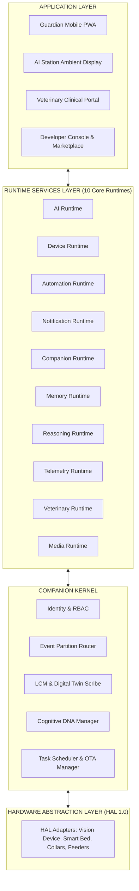

# 💻 PO-0170 — COMPANION OPERATING SYSTEM (COS) SPECIFICATION
**Version**: 1.0  
**Status**: Approved Master Operating System Architecture Specification  
**Authors**: OS Architecture Council, Chief AI Scientist, Enterprise Platform Engineering Division  
**Target Horizon**: 2026 – 2050  

---

## 1. EXECUTIVE SUMMARY & BUSINESS VISION

**PO-0170** specifies **Companion OS (COS)**, the foundational operating system orchestrating the entire Project One ecosystem across cloud serverless nodes, ambient tabletop AI Stations, mobile PWAs, tablets, smart TVs, automotive head units, and wearable devices.

Project One is no longer a software dashboard or a simple camera app. Companion OS operates as a multi-runtime, event-driven, cognitive operating system. It manages hardware abstraction, non-invasive bio-telemetry ingestion, multi-cortex neural reasoning, lifelong behavioral digital twins, and human-centered explainable story generation through a unified kernel API.

---

## 2. COMPANION OS OPERATING PRINCIPLES

1. **Everything Event-Driven**: Direct synchronous API calls between subsystems are forbidden; all state changes flow over the Event Bus.
2. **Everything Explainable**: Every decision, alert, or intervention includes human-readable evidence lineage [PO-0150].
3. **Everything Observable**: Complete telemetry, tracing, and metric collection across all kernel runtimes.
4. **Everything Secure & Private**: Zero-trust multi-tenancy enforced at the kernel via PostgreSQL RLS.
5. **Everything Belongs to a Domain**: Every application, widget, or feature maps strictly to one of the Nine Business Domains [PO-0160].
6. **Everything Contributes to the LCM**: All raw observations enrich the companion's Living Companion Model [PO-0140].

---

## 3. OS LAYERED ARCHITECTURE MAP



---

## 4. THE COMPANION KERNEL & 10 CORE RUNTIME SERVICES

### 4.1 The Companion Kernel
The Companion Kernel manages fundamental OS primitives:
- **Session Managers**: Living Companion Model (LCM) sessions, Cognitive DNA sessions, Memory Vault sessions.
- **Kernel Scheduling**: Priority scheduling for real-time acoustic distress interventions over background downsampling.
- **Storage & Security**: Dual-bank OTA verification, PostgreSQL RLS tenant scoping, hardware certificate validation.

---

### 4.2 The 10 Core Runtime Services
1. **AI Runtime**: Manages local TPU ONNX/TensorRT neural model execution (YOLO11, Wav2Vec).
2. **Device Runtime**: PDP 1.0 message transport broker and HAL driver lifecycle management.
3. **Automation Runtime**: Executes multi-policy automation rules (Guardian, Veterinary, Home, Emergency).
4. **Notification Runtime**: Routes 5-tier notifications [PO-0150] based on user persona modes.
5. **Companion Runtime**: Manages real-time updates to the Companion State Vector $\mathbf{S}_{\text{lcm}}(t)$.
6. **Memory Runtime**: Manages the 8-tier memory system (Daily, Weekly, Lifetime, Medical, Emotional).
7. **Reasoning Runtime**: Orchestrates the 10-stage Reasoning Engine (CRE) and Evidence Graphs.
8. **Telemetry Runtime**: Ingests, validates, and downsamples high-frequency BCG/optical streams.
9. **Veterinary Runtime**: Generates clinical diagnostic PDF reports and vaccination timelines.
10. **Media Runtime**: Zero-copy WebRTC video streaming and 432 Hz acoustic playback management.

---

## 5. UNIVERSAL SEARCH & COMMAND PALETTE

Companion OS exposes a unified system-wide command and search interface accessible via voice ("Hey Compawion") or `Cmd+K` / `Ctrl+K`:

```text
> Cmd + K ──► "Feed Thor 50 grams"               ──► Dispatches PDP Action to Smart Feeder
> Cmd + K ──► "Show today's reasoning for Lola"  ──► Opens CRE Evidence Graph Trace
> Cmd + K ──► "Generate veterinary PDF report"   ──► Renders Clinical Vet Document
> Cmd + K ──► "Locate Lola in house"             ──► Displays Home Spaces Presence Map
> Cmd + K ──► "Activate calming mode"            ──► Plays 432 Hz Soundscape on AI Station
```

---

## 6. COMPANION OS MARKETPLACE & PARTNER SDK

COS includes an open developer platform allowing 3rd-party developers and hardware OEMs to publish:
- **Third-Party AI Skills**: Customized behavioral detection models (e.g. specialized agility training classifiers).
- **OEM Device Drivers**: "PDL Certified" capability descriptors for smart dog doors, automatic water fountains, and smart collars.
- **Automation Packs**: Curated routine schedules for specific breeds or post-surgical recovery protocols.

---

## 7. 🔒 PATENT CANDIDATES PORTFOLIO

### 🔒 Patent Candidate PO-PAT-COS-001
- **Title**: Companion Operating System (COS) Multi-Runtime Architecture for Animal Telemetry & Intelligence.
- **Problem**: Monolithic smart home software applications failing to coordinate real-time bio-telemetry, neural vision models, and distributed hardware sensors across multiple device form-factors.
- **Innovation**: An operating system architecture isolating hardware abstraction, neural AI runtimes, memory vaults, and multi-domain user experiences behind a unified companion kernel.
- **Claims**: An operating system for multi-sensor companion animal management.

### 🔒 Patent Candidate PO-PAT-COS-002
- **Title**: Companion Kernel Execution Manager for Dynamic Cognitive DNA & Digital Twin Synchronization.
- **Problem**: Inability of IoT kernels to prioritize real-time biological distress interventions over high-bandwidth cloud sync events.
- **Innovation**: A specialized cognitive kernel scheduler prioritizing real-time acoustic interventions while background-processing downsampled biometric archives.
- **Claims**: A kernel scheduling method for biological anomaly prioritization.

### 🔒 Patent Candidate PO-PAT-COS-003
- **Title**: Universal Semantic Command Engine for Companion Operating Systems.
- **Problem**: Rigid menu structures requiring manual navigation to locate pet events or trigger actions.
- **Innovation**: A unified semantic command engine mapping natural voice or text queries directly to underlying PDP device action endpoints and CRE reasoning traces.
- **Claims**: A method for universal command execution in animal intelligence operating systems.
