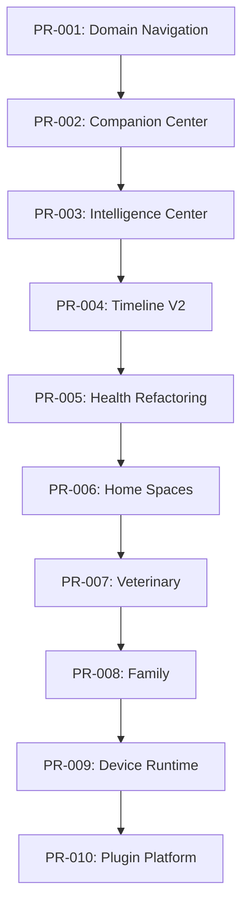

# 🚀 PROJECT ONE — VERSION 2 EVOLUTION PROGRAM
## Document ID: PO-0210
### Incremental Migration Strategy: From MVP App to Companion OS
**Version**: 2.0  
**Classification**: Engineering Roadmap & Implementation Specification  
**Guiding Principle**: *"Never redesign. Never rewrite. Never lose working code. Evolve incrementally while preserving 100% operational uptime."*

---

## 🎯 EXECUTIVE SUMMARY & EVOLUTION PHILOSOPHY

Project One V1 is functional, authenticated, multi-tenant, and deployed. It features a working Next.js 16 app, Supabase RLS security across 20 tables, real-time device tracking, and streaming AI assistant endpoints.

Version 2 is **NOT a rewrite**. Version 2 is the **architectural evolution** of Project One into **Companion OS**. 

This document defines:
1. **Domain-Driven Experience (DDX) Navigation Transformation** (from feature-centric menus to 9 business domains).
2. **Codebase Asset Audit** (reuse, rename, move, deprecate).
3. **Sequential Pull Request Roadmap (PR-001 to PR-010)** with strict acceptance criteria and zero downtime.

---

## 🗺️ TASK 1: DOMAIN-DRIVEN NAVIGATION MIGRATION (9 BUSINESS DOMAINS)

```
V1 Feature Navigation                  V2 Domain-Driven Navigation (DDX)
---------------------                  ----------------------------------
Dashboard                       ───►   🏠 Home
Pets                            ───►   🐾 Companion (LCM & Cognitive DNA)
AI Assistant / Alerts           ───►   🧠 Intelligence Center
Health                          ───►   ❤️ Health Domain
Rooms                           ───►   🏡 Home Spaces
Devices                         ───►   🔌 Device Platform
[NEW]                           ───►   👨‍⚕️ Veterinary Domain
[NEW]                           ───►   👨‍👩‍👧 Family & Caregivers
Settings / Notifications        ───►   ⚙️ Platform & Security
```

---

### 1. 🏠 HOME DOMAIN (`/dashboard`)
* **Business Purpose**: Provide immediate peace of mind for guardians within 3 seconds of opening the app.
* **Current Implementation**: `DashboardShell.tsx` + `dashboard/page.tsx` displaying health ring score, story timeline, and pet vital status cards.
* **Migration Strategy**: Wrap existing `sampleStoryTimeline` and health cards with real-time Supabase hooks (`useRealtimeEvents`).
* **New UI**: Live "Guardian Daily Story" feed with event severity highlights and multi-pet switcher tab bar.
* **Backward Compatibility**: Preserves `/dashboard` URL as default root view; all existing bookmarks resolve seamlessly.
* **Future Roadmap**: Widget customizable canvas grid for multi-companion households.

---

### 2. 🐾 COMPANION DOMAIN (`/dashboard/pets` ➔ `/dashboard/companion`)
* **Business Purpose**: Serve as the living cognitive representation of the companion's entire life.
* **Current Implementation**: `pets/page.tsx` + `pets/[petId]/page.tsx` providing CRUD for pet name, breed, weight, species, and birthdate.
* **Migration Strategy**: Extend `pets` table relationships to fetch `pet_profiles` (behavioral baselines), `behavior_baselines`, and Cognitive DNA tensors in a single query.
* **New UI**: Tabbed interface featuring:
  * **Profile**: Core identity & biological traits.
  * **Cognitive DNA**: Lifelong behavioral radar chart (sleep stability, anxiety index, activity decay).
  * **Living Companion Model (LCM)**: Real-time current status (e.g., "Sleeping in Living Room — 94% normal").
  * **Memories & Story**: AI-curated highlight clips.
* **Backward Compatibility**: Alias `/dashboard/pets` to redirect automatically to `/dashboard/companion`.
* **Future Roadmap**: Genetic DNA integration and multi-pet social interaction graph.

---

### 3. 🧠 INTELLIGENCE DOMAIN (`/dashboard/assistant` ➔ `/dashboard/intelligence`)
* **Business Purpose**: Transform simple chat interactions into proactive cognitive reasoning and explainable recommendations.
* **Current Implementation**: `/dashboard/assistant/page.tsx` + `/api/chat/route.ts` using Vercel AI SDK and OpenRouter.
* **Migration Strategy**: Preserve existing Vercel AI SDK stream, but wrap system prompt with full Living Companion Model (LCM) context and event history.
* **New UI**:
  * **Insights Feed**: Proactive AI-detected anomalies ("Thor woke up 3x last night").
  * **Ask AI**: Direct chat bar with pet context pre-loaded.
  * **Weekly/Monthly Executive Summaries**: AI-generated health & behavior digest PDFs/cards.
  * **Reasoning Transparency Engine**: Click "Why?" on any alert to view confidence score & bounding box clip.
* **Backward Compatibility**: Maintain `/dashboard/assistant` as a client route linking into the Ask AI tab.
* **Future Roadmap**: Edge-based local LLM fallback when offline.

---

### 4. ❤️ HEALTH DOMAIN (`/dashboard/health`)
* **Business Purpose**: Track, analyze, and predict companion physical biometrics and medical parameters.
* **Current Implementation**: `/dashboard/health/page.tsx` with static charts for heart rate, activity, and weight.
* **Migration Strategy**: Connect charts to `/api/health` queries fetching real `health_metrics` table records.
* **New UI**: 8 structured vital sub-modules: Sleep Quality Index, Nutrition/Caloric Balance, Hydration Intake, Weight Trajectory, Respiration Baseline, Medication Tracker, Post-Op Recovery Mode, Vet Export.
* **Backward Compatibility**: Retains existing route structure; defaults to 30-day historical view.
* **Future Roadmap**: Continuous BCG piezo sensor waveforms from Smart Bed.

---

### 5. 🏡 HOME SPACES DOMAIN (`/dashboard/rooms` ➔ `/dashboard/spaces`)
* **Business Purpose**: Map physical room environments to companion behavior and sensor presence.
* **Current Implementation**: Static rooms list showing location names.
* **Migration Strategy**: Join `device_locations` with `devices` and `pet_events` to show real-time pet presence per room.
* **New UI**: Spatial map grid (Living Room, Kitchen, Garden, Bedroom) with live camera matrix, heatmaps of favorite sleeping spots, and environmental temperature/humidity indicators.
* **Backward Compatibility**: Route `/dashboard/rooms` redirects to `/dashboard/spaces`.
* **Future Roadmap**: 3D spatial digital floorplan overlay.

---

### 6. 🔌 DEVICE PLATFORM DOMAIN (`/dashboard/devices`)
* **Business Purpose**: Orchestrate universal IoT hardware nodes, protocol drivers, and edge vision sensors.
* **Current Implementation**: `DeviceGrid.tsx` + `RegisterDeviceDialog.tsx` + `/api/devices/heartbeat` with real-time status.
* **Migration Strategy**: Extend device type registry to support ONVIF/RTSP cameras, BLE collar tags, and Matter/MQTT smart home bridges.
* **New UI**: Universal Hardware Hub showing connection topology, battery levels, firmware update buttons, and RTSP stream previews.
* **Backward Compatibility**: 100% backward compatible with current DB schema.
* **Future Roadmap**: Third-party plugin market for non-standard hardware drivers.

---

### 7. 👨‍⚕️ VETERINARY DOMAIN (`/dashboard/veterinary`)
* **Business Purpose**: Bridge guardian home monitoring data with clinical veterinary workflows.
* **Current Implementation**: Placeholder route.
* **Migration Strategy**: Create `medical_records` and `vet_reports` queries bound to pet ID.
* **New UI**: Medical timeline, vaccination log, active prescriptions, appointments calendar, and One-Click PDF/FHIR Vet Clinical Export button.
* **Backward Compatibility**: Fully additive; zero impact on existing tables.
* **Future Roadmap**: Direct Telehealth video consult integration.

---

### 8. 👨‍👩‍👧 FAMILY & CAREGIVERS DOMAIN (`/dashboard/family`)
* **Business Purpose**: Enable multi-user household access, pet sitter controls, and role-based permissions.
* **Current Implementation**: Single-user owner view tied to `profiles`.
* **Migration Strategy**: Leverage `profiles.role` (`owner`, `admin`, `member`, `viewer`) and create household invitation flow.
* **New UI**: Caregiver list (Family Members, Pet Sitters, Dog Walkers), temporary access passes, emergency contact cards, and notification preference matrix per user.
* **Backward Compatibility**: Default existing users remain `owner` role.
* **Future Roadmap**: Individual human voice profile recognition for multi-guardian households.

---

### 9. ⚙️ PLATFORM DOMAIN (`/dashboard/settings`)
* **Business Purpose**: Manage account security, organization multi-tenancy, subscription billing, and platform automations.
* **Current Implementation**: `/dashboard/settings/page.tsx` with basic profile controls.
* **Migration Strategy**: Modularize settings into Security/RLS Audit, Subscription & Billing (Stripe), Privacy Controls, API Key Management, and Notification Channels.
* **New UI**: Tabbed enterprise administrative suite with audit logs and subscription tiering.
* **Backward Compatibility**: `/dashboard/settings` remains intact.
* **Future Roadmap**: Automated data export & GDPR right-to-be-forgotten deletion workflows.

---

## 🔍 TASK 2: CODEBASE AUDIT & ASSET REFACTORING

```
┌─────────────────────────────────────────────────────────────────────────────┐
│ CODEBASE AUDIT MATRIX                                                       │
├──────────────────────────────┬──────────────────────────────────────────────┤
│ REUSE AS-IS (100% Operational)│ Supabase Server Client (`lib/supabase/*`)   │
│                              │ Auth Middleware (`middleware.ts`)            │
│                              │ UI Primitives (`Avatar`, `Badge`, `Card`)    │
├──────────────────────────────┼──────────────────────────────────────────────┤
│ RENAME & EVOLVE              │ `pets` ──► `companion`                       │
│                              │ `assistant` ──► `intelligence`               │
│                              │ `rooms` ──► `spaces`                         │
├──────────────────────────────┼──────────────────────────────────────────────┤
│ MOVE / REFACTOR              │ Hardcoded mock data ──► Real Supabase Queries│
│                              │ Single-file pages ──► Feature component modules│
├──────────────────────────────┼──────────────────────────────────────────────┤
│ DEPRECATE (Clean Up)         │ `sampleStoryTimeline` static array           │
│                              │ Temporary hardcoded vital score strings      │
└──────────────────────────────┴──────────────────────────────────────────────┘
```

---

## 🛠️ TASK 3: SEQUENTIAL PULL REQUEST ROADMAP (PR-001 TO PR-010)



---

### 📦 PR-001: Domain Navigation Refactoring
* **Objective**: Refactor navigation from feature-driven to Domain-Driven Experience (DDX) across sidebar, mobile header, and layout routes.
* **Files**: `apps/web/src/app/(dashboard)/DashboardShell.tsx`
* **Components**: `DashboardShell` sidebar menu links, domain icon mappings.
* **APIs**: None (UI Navigation only).
* **Database Changes**: None.
* **Estimated Time**: 2 hours.
* **Dependencies**: None.
* **Acceptance Criteria**: All 9 domains present in sidebar; active state highlights correctly; 100% mobile responsive drawer navigation; 0 broken links.

---

### 📦 PR-002: Companion Center (LCM & Cognitive DNA UI)
* **Objective**: Evolve `/dashboard/pets` into `/dashboard/companion` with tabbed LCM and Cognitive DNA identity metrics.
* **Files**:
  * `apps/web/src/app/(dashboard)/dashboard/pets/page.tsx`
  * `apps/web/src/features/pets/CompanionCenter.tsx` [NEW]
  * `apps/web/src/features/pets/CognitiveDNACard.tsx` [NEW]
* **Components**: `CompanionCenter`, `CognitiveDNACard`, `BaselineStatusPill`.
* **APIs**: Uses existing `/server/actions/pets.ts`.
* **Database Changes**: None (uses `pet_profiles` table).
* **Estimated Time**: 4 hours.
* **Dependencies**: PR-001.
* **Acceptance Criteria**: Shows pet profile + behavioral baseline stats; tab switching works without page reload; edit/add pet forms operational.

---

### 📦 PR-003: Intelligence Center & Explainability
* **Objective**: Replace basic chat view with full Companion Intelligence Center featuring proactive insights and Vercel AI SDK Ask AI integration.
* **Files**:
  * `apps/web/src/app/(dashboard)/dashboard/assistant/page.tsx`
  * `apps/web/src/features/intelligence/IntelligenceCenter.tsx` [NEW]
  * `apps/web/src/app/api/chat/route.ts`
* **Components**: `IntelligenceCenter`, `AskAIBAR`, `InsightCard`, `ReasoningModal`.
* **APIs**: `/api/chat` (streaming response).
* **Database Changes**: Fetch top 20 recent events into system prompt context.
* **Estimated Time**: 5 hours.
* **Dependencies**: PR-001.
* **Acceptance Criteria**: Live streaming response; pet context correctly injected into system prompt; reasoning transparency modal displays confidence scores.

---

### 📦 PR-004: Cognitive Timeline V2
* **Objective**: Upgrade home page and event log to Cognitive Timeline with AI interpretation, confidence scores, and video clip thumbnails.
* **Files**:
  * `apps/web/src/app/(dashboard)/dashboard/page.tsx`
  * `apps/web/src/app/(dashboard)/dashboard/events/page.tsx`
  * `apps/web/src/features/events/CognitiveTimeline.tsx` [NEW]
* **Components**: `CognitiveTimeline`, `TimelineItemV2`, `SeverityFilterBar`.
* **APIs**: `/api/events` (GET).
* **Database Changes**: Add index `idx_pet_events_org_time` if missing.
* **Estimated Time**: 4 hours.
* **Dependencies**: PR-001, PR-003.
* **Acceptance Criteria**: Real-time event insertion via `useRealtimeEvents`; filter by severity (info, warning, critical); empty state renders cleanly.

---

### 📦 PR-005: Health Domain Refactoring
* **Objective**: Connect health page to real Supabase metrics with 8 vital monitoring sub-modules.
* **Files**:
  * `apps/web/src/app/(dashboard)/dashboard/health/page.tsx`
  * `apps/web/src/features/health/HealthDashboard.tsx` [NEW]
  * `apps/web/src/features/health/MetricChartCard.tsx` [NEW]
* **Components**: `HealthDashboard`, `MetricChartCard`, `SleepQualityRing`.
* **APIs**: `/api/health` (GET/POST).
* **Database Changes**: None (uses `health_metrics` table).
* **Estimated Time**: 6 hours.
* **Dependencies**: PR-001.
* **Acceptance Criteria**: Dynamic rendering of weight, sleep, activity, hydration metrics; date range selector (7d, 30d, 90d); clean chart tooltips.

---

### 📦 PR-006: Home Spaces & Camera Matrix
* **Objective**: Transform rooms page into interactive spatial presence grid with camera stream previews.
* **Files**:
  * `apps/web/src/app/(dashboard)/dashboard/cameras/page.tsx`
  * `apps/web/src/features/spaces/HomeSpacesGrid.tsx` [NEW]
* **Components**: `HomeSpacesGrid`, `CameraMatrixCard`, `PetPresenceBadge`.
* **APIs**: Fetch `device_locations` + `devices`.
* **Database Changes**: None.
* **Estimated Time**: 4 hours.
* **Dependencies**: PR-001.
* **Acceptance Criteria**: Spatial grid renders room cards; displays devices assigned per room; live pet presence indicator based on latest room event.

---

### 📦 PR-007: Veterinary Clinical Portal & Export
* **Objective**: Create dedicated Veterinary domain page with medical history logging and PDF/FHIR report export.
* **Files**:
  * `apps/web/src/app/(dashboard)/dashboard/veterinary/page.tsx` [NEW]
  * `apps/web/src/features/veterinary/VetPortalView.tsx` [NEW]
  * `apps/web/src/server/actions/medical.ts` [NEW]
* **Components**: `VetPortalView`, `MedicalTimeline`, `ClinicalReportExportButton`.
* **APIs**: Medical records CRUD Server Actions.
* **Database Changes**: Leverage `medical_records` table.
* **Estimated Time**: 5 hours.
* **Dependencies**: PR-001, PR-005.
* **Acceptance Criteria**: Medical records listed chronologically; add record modal works; export report generates structured JSON/PDF summary.

---

### 📦 PR-008: Family & Caregiver Management
* **Objective**: Add multi-user caregiver access control, pet sitter views, and notification channels.
* **Files**:
  * `apps/web/src/app/(dashboard)/dashboard/family/page.tsx` [NEW]
  * `apps/web/src/features/family/FamilyManagement.tsx` [NEW]
* **Components**: `FamilyManagement`, `CaregiverCard`, `InviteMemberDialog`.
* **APIs**: Server Action for inviting org members.
* **Database Changes**: None (uses `profiles` table with `role` enum).
* **Estimated Time**: 4 hours.
* **Dependencies**: PR-001.
* **Acceptance Criteria**: Shows household members; role badges displayed (`owner`, `member`, `viewer`); invite caregiver dialog functions.

---

### 📦 PR-009: Device Platform Runtime (PDP 1.0 Integration)
* **Objective**: Refactor device management to support PDP 1.0 telemetry standards, RTSP previews, and automated heartbeat tracking.
* **Files**:
  * `apps/web/src/features/devices/DeviceGrid.tsx`
  * `apps/web/src/features/devices/RegisterDeviceDialog.tsx`
  * `apps/web/src/app/api/devices/heartbeat/route.ts`
* **Components**: `DeviceGrid`, `RegisterDeviceDialog`, `HeartbeatBadge`.
* **APIs**: `/api/devices/heartbeat` (POST).
* **Database Changes**: None.
* **Estimated Time**: 3 hours.
* **Dependencies**: PR-001.
* **Acceptance Criteria**: Real-time device status updates; serial number validation; device location linking working 100%.

---

### 📦 PR-010: Plugin & Automation Platform
* **Objective**: Add automation trigger rules (e.g., "If barking > 3 mins, play calm voice clip") and external plugin webhooks.
* **Files**:
  * `apps/web/src/app/(dashboard)/dashboard/settings/page.tsx`
  * `apps/web/src/features/platform/AutomationRules.tsx` [NEW]
* **Components**: `AutomationRules`, `WebhookManager`, `SecurityAuditLog`.
* **APIs**: `/api/automations` [NEW].
* **Database Changes**: Leverage `autonomous_actions` table.
* **Estimated Time**: 5 hours.
* **Dependencies**: PR-001 to PR-009.
* **Acceptance Criteria**: Create/toggle automation rules; view security audit logs; API key management tab operating.

---

## 🗓️ MIGRATION EXECUTION CALENDAR

```
Sprint 1 (Weeks 1-2):  PR-001 (Navigation) + PR-009 (Devices) + PR-004 (Timeline V2)
Sprint 2 (Weeks 3-4):  PR-002 (Companion)  + PR-003 (Intelligence Center)
Sprint 3 (Weeks 5-6):  PR-005 (Health)     + PR-006 (Home Spaces)
Sprint 4 (Weeks 7-8):  PR-007 (Veterinary) + PR-008 (Family)
Sprint 5 (Weeks 9-10): PR-010 (Plugin & Platform Automations)
```

---

**Approved by the Project One Engineering Executive Team — August 2026.**
