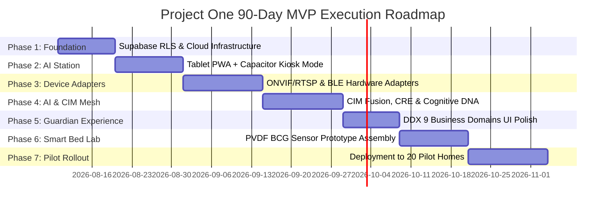

# 🚀 PO-0180 — PROJECT ONE MVP EXECUTION PLAN (90-DAY LAUNCH DIRECTIVE)
**Version**: 1.0  
**Status**: Approved Launch Directive  
**Role**: Chief Technology Officer & Founding Engineering Team  
**Target Launch Window**: 90 Days to First Commercial Pilot Homes  

---

## 1. EXECUTIVE SUMMARY & MVP PHILOSOPHY

**PO-0180** establishes the 90-day commercial execution plan for **Project One**.

Having completed a mature enterprise architecture framework (**PO-0000** through **PO-0170**), our mandate shifts from pure system design to rapid commercial execution. 

### Core MVP Philosophy
- **Project One is an Intelligence Platform**, not a hardware manufacturing startup.
- **Build only what creates sustainable competitive advantage**: Project One Brain Core, Cognitive Reasoning Engine (CRE), Cognitive DNA, Living Companion Model (LCM), Companion Intelligence Mesh (CIM), Guardian Intelligence Engine (GIE), and the non-invasive Smart Bed prototype.
- **Integrate everything else**: Leverage off-the-shelf consumer hardware—ONVIF/RTSP IP cameras, Android tablets (AI Station PWA Kiosk Mode), BLE collars/tags, ESP32 microcontrollers, and Tuya/Zigbee/Matter smart feeders, water fountains, and scales.
- **Optimize for Learning**: Prioritize speed, customer feedback, validation, and zero-error codebase stability over mass manufacturing.

---

## 2. 90-DAY EXECUTION ROADMAP & 7 PHASES

---

## 3. PRIORITIZED BACKLOG & SPRINT ALLOCATION

| ID | Backlog Item Name | Priority | Business Value | Tech Complexity | Dependencies | Est. Days | Acceptance Criteria |
| :--- | :--- | :--- | :--- | :--- | :--- | :--- | :--- |
| **BACK-01** | **Supabase RLS & Auth Engine** | P0 (Critical) | High | Medium | None | 5d | Enforces `get_user_org_id()` on 20 DB tables |
| **BACK-02** | **Android PWA Kiosk Mode** | P0 (Critical) | High | Medium | BACK-01 | 7d | Runs full-screen ambient mode on Android tablet |
| **BACK-03** | **ONVIF / RTSP Camera Adapter** | P0 (Critical) | High | High | BACK-01 | 8d | Ingests 1080p RTSP stream and extracts motion keypoints |
| **BACK-04** | **PDP 1.0 Event Bus & Parser** | P0 (Critical) | High | Medium | BACK-01 | 5d | Parses `pet.sleep.started` JSON payload |
| **BACK-05** | **CIM Sensor Fusion Engine** | P0 (Critical) | Extreme | High | BACK-03, BACK-04 | 7d | Fuses Vision + Bed telemetry into joint confidence |
| **BACK-06** | **Cognitive DNA Vector 128-D** | P1 (High) | Extreme | High | BACK-05 | 6d | Calculates $\Delta_{\text{drift}}(t)$ vector distance |
| **BACK-07** | **GIE Guardian Story Mode** | P1 (High) | High | Medium | BACK-06 | 5d | Renders daily human story narratives |
| **BACK-08** | **Smart Bed BCG Hardware Lab** | P1 (High) | High | High | BACK-04 | 8d | Extracts heart rate (BPM) via PVDF film |
| **BACK-09** | **DDX Navigation UI Polish** | P1 (High) | Medium | Low | BACK-01 | 4d | Renders 9 Core Business Domains in Next.js 16 |
| **BACK-10** | **20-Home Pilot Provisioning** | P0 (Critical) | Extreme | Medium | All Above | 14d | Installs in 20 homes with 30 active pets |

---

## 4. COMPANION LABORATORY HARDWARE PROCUREMENT

To validate the platform in real homes without manufacturing delays, the founding team will procure off-the-shelf hardware for the **Companion Laboratory**:

| Hardware Equipment | Model / Vendor | Quantity | Est. Unit Cost | Total Cost | Strategic Purpose |
| :--- | :--- | :--- | :--- | :--- | :--- |
| **AI Station Tablet** | Lenovo Tab M10 / Samsung Galaxy Tab A8 | 20 units | $120.00 | $2,400.00 | Kiosk Mode Ambient Hub |
| **4K Optical Camera** | Reolink 4K ONVIF / TP-Link Tapo C200 | 30 units | $45.00 | $1,350.00 | Vision Sensor Integration |
| **Microcontroller Boards** | ESP32-S3-WROOM-1 N16R8 | 50 units | $4.50 | $225.00 | HAL & Sensor Nodes |
| **BCG Sensor Film** | TE Connectivity PVDF Piezo Film | 25 units | $12.00 | $300.00 | Smart Bed Lab Prototyping |
| **Smart Feeder / Water** | Tuya Wi-Fi Smart Feeder / Water Fountain | 20 units | $35.00 | $700.00 | Nutrition & Hydration Node |
| **BLE Beacons / Tags** | Nordic nRF52840 BLE Beacon Tags | 30 units | $8.00 | $240.00 | Pet Collar Tracking |
| **Total Lab Procurement**| | | | **$5,215.00** | **Complete Pilot Lab Setup** |

---

## 5. CLOUD TECH STACK JUSTIFICATION

1. **Next.js 16 App Router (Vercel Edge)**: Ultra-fast serverless PWA rendering with zero infrastructure management.
2. **Supabase PostgreSQL & `pgvector`**: Native multi-tenant Row Level Security (`get_user_org_id()`) combined with vector embeddings for Digital Twin memory retrieval.
3. **OpenRouter API Broker**: Model-agnostic LLM/Vision routing (GPT-4o, Claude 3.5 Sonnet) ensuring zero vendor lock-in.

---

## 6. PILOT PROGRAM DESIGN (20 HOMES / 30 PETS)

### Pilot Strategy
- **Deployment Scope**: 20 pilot households in metropolitan areas containing 30 total companion animals (20 dogs, 10 cats).
- **Hardware Deployment per Home**: 1x AI Station Tablet, 1x-2x ONVIF IP Cameras, 1x Smart Bed Prototype, 1x BLE Collar Tag.
- **Key Performance Indicators (KPIs)**:

| KPI Category | Target Metric | Success Benchmark |
| :--- | :--- | :--- |
| **Technical KPI** | System Uptime & Latency | $99.9\%$ Uptime, Event-to-Story $<300\text{ms}$ |
| **AI Reliability KPI** | Fused Anomaly Confidence | $>92\%$ Positive Predictive Value (PPV) |
| **User Engagement KPI** | Guardian Daily Active Usage | $>4.5\text{ logins/day}$, Story read rate $>85\%$ |
| **Business KPI** | Willingness to Pay | $>75\%$ pilot conversion to $\$19.99/\text{mo}$ subscription |

---

## 7. RISK MATRIX & MITIGATION CONTROLS

| Identified Risk | Severity | Probability | Mitigation Control |
| :--- | :--- | :--- | :--- |
| **IP Camera Compatibility Failures** | Medium | High | Support fallback ONVIF/RTSP transcoder proxy in HAL |
| **BCG Signal Noise in Memory Foam** | High | Medium | Implement digital bandpass FIR wavelet filter on ESP32-S3 |
| **Home Wi-Fi Disconnection** | Medium | High | Maintain local SQLite event buffer on AI Station Tablet |
| **False Emergency Alerts** | High | Low | Enforce CIM multi-sensor fusion confidence threshold ($\ge 90\%$) |

---

*Project One MVP Execution Plan — Approved for Immediate 90-Day Sprint.*
