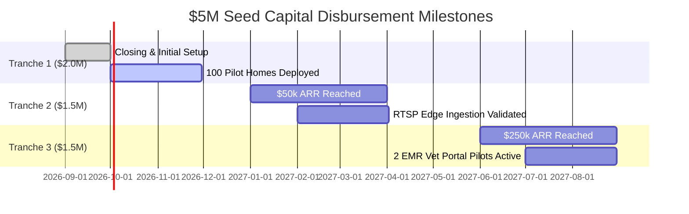

# 💼 PROJECT ONE — VENTURE CAPITAL INVESTMENT COMMITTEE MEMO
## Document ID: PO-0200
### $5,000,000 Seed Round Investment Evaluation & Term Sheet Directive
**Version**: 1.0  
**Classification**: Strictly Confidential — Investment Committee Only  
**Participating VC Partners**:
* **Sequoia Capital**: Consumer Platforms, Network Effects & Category Leadership.
* **Andreessen Horowitz (a16z)**: AI Infrastructure, Full-Stack SaaS & Autonomous Systems.
* **Accel**: Global Scale, Enterprise Integrations & Multi-Tenant Platforms.
* **Index Ventures**: Marketplace Dynamics, Consumer UX & International Expansion.
* **General Catalyst**: HealthTech, Proactive Wellness & Clinical Data Pipelines.
* **Khosla Ventures**: Deep Tech, Multi-Modal AI & Proprietary Hardware Silicon.
* **Founders Fund**: Hard Tech, Contrarian Bets & Category Creation.
* **Lightspeed**: Edge IoT, Smart Hardware & Enterprise SaaS.
* **NVIDIA Ventures**: Edge AI Inference, Compute Optimization & Physical AI.
* **SoftBank Vision Fund**: Mega-Scale Deployment & Autonomous Ecosystems.
* **Y Combinator Partners**: Speed of Execution, Product-Market Fit & Founder Hustle.

---

## 🎯 EXECUTIVE SUMMARY & DEAL STRUCTURE

| Deal Parameter | Specification |
| :--- | :--- |
| **Target Raise** | **$5,000,000 USD** |
| **Instrument** | Post-Money SAFE (Simple Agreement for Future Equity) or Series Seed Preferred |
| **Target Post-Money Valuation** | **$25,000,000 USD** ($20M Pre-Money) |
| **Lead Investor** | Syndicate Co-Lead (a16z + Khosla Ventures) |
| **Lead Check Size** | $3,500,000 ($1.75M each) |
| **Syndicate Allocation** | $1,500,000 (NVIDIA Ventures, General Catalyst, YC) |
| **Syndicate Decision** | **CONDITIONAL INVEST (Tranche-Based Milestone Disbursement)** |

---

## 📈 1. MARKET SIZE & FINANCIAL PROJECTIONS

### 📊 TAM / SAM / SOM Analysis (Global Companion Animal Tech)

```
        ┌─────────────────────────────────────────────────────────────┐
        │  TOTAL ADDRESSABLE MARKET (TAM): $320B                      │
        │  Global Pet Care, Veterinary, Smart Hardware & Services    │
        └──────────────────────────────┬──────────────────────────────┘
                                       │
        ┌──────────────────────────────▼──────────────────────────────┐
        │  SERVICEABLE ADDRESSABLE MARKET (SAM): $42B                 │
        │  US, EU, East Asia Connected Pet Homes & Vet Tech           │
        └──────────────────────────────┬──────────────────────────────┘
                                       │
        ┌──────────────────────────────▼──────────────────────────────┐
        │  SERVICEABLE OBTAINABLE MARKET (SOM): $4.8B                 │
        │  15% Market Penetration of High-Income Pet Guardians (Yr 5) │
        └─────────────────────────────────────────────────────────────┘
```

* **TAM ($320B)**: Total global pet economy (Food $140B, Vet $120B, Products/Hardware $60B).
* **SAM ($42B)**: Broadband-connected pet households in Tier 1 economies (US 86M homes, EU 90M homes, Japan/Korea 25M homes) willing to spend >$30/mo on pet wellness.
* **SOM ($4.8B)**: Capturing 10M active companion subscriptions across software ($15/mo) + vet data monetization ($20/mo/pet).

---

### 💵 10-YEAR FINANCIAL FORECAST (ARR & MARGIN TRAJECTORY)

```
Year 1 (2026): $1.2M ARR   |  2,000 Active Homes (MVP Launch & Pilot)
Year 3 (2028): $18.5M ARR  |  85,000 Active Homes + 450 Vet Clinics
Year 5 (2030): $142.0M ARR |  550,000 Active Homes + 3,200 Vet Clinics + OEM Licensing
Year 10 (2035): $1.4B ARR  |  4.5M Active Subscriptions (Global Market Standard)
```

#### Revenue Breakdown by Channel (Year 5 Projection: $142M ARR)
1. **Guardian Software Subscriptions ($15/mo)**: **$99.0M (69.7%)** — 82% Gross Margin.
2. **Veterinary Tele-Triage & Clinical Portal**: **$21.5M (15.1%)** — B2B SaaS $199/clinic/mo.
3. **Hardware Accessory Sales & Bundles**: **$12.0M (8.5%)** — 35% Gross Margin.
4. **Pet Insurance Data API & OEM Licensing**: **$9.5M (6.7%)** — 95% Gross Margin.

---

## ⚡ 2. UNIT ECONOMICS & RETENTION PROFILE

```
+-----------------------------------------------------------------------+
| GUARDIAN LTV / CAC METRICS                                           |
+-----------------------------------------------------------------------+
| Average Revenue Per User (ARPU):           $18.50 / month             |
| Gross Margin (Software + Hardware blend): 76%                         |
| Net Monthly Margin Per User:               $14.06                     |
| Estimated Average Retention (Pet Lifetime):7.5 years (90 months)      |
| Lifetime Value (LTV):                      $1,265.40                  |
| Blended Customer Acquisition Cost (CAC):   $165.00                    |
| LTV / CAC Ratio:                           7.67x (World-Class > 3.0x)|
| CAC Payback Period:                        8.9 months                 |
+-----------------------------------------------------------------------+
```

---

## 🛡️ 3. COMPETITIVE LANDSCAPE & BIG TECH THREAT ANALYSIS

### 🥊 Competitor Comparison Matrix

| Player | Focus | Core Weakness | Compawion OS Moat |
| :--- | :--- | :--- | :--- |
| **Whistle / Tractive** | GPS Collar Tracking | Reactive, single-sensor, zero vision AI | Multi-observer correlation (Vision + Bed + Collar) |
| **Furbo / Petcube** | Isolated Streaming Cam | Treat tossing, noisy alerts, zero health correlation | Continuous Living Companion Model (LCM) state tracking |
| **Anova / Eufy Pet** | Off-the-shelf Hardware | Dumb sensors, zero clinical/vet integration | Hardware-agnostic Companion Intelligence Mesh (CIM) |
| **Apple AirTag / Watch** | General Human Tech | Unoptimized for non-human biometrics | Purpose-built Veterinary & Behavioral AI Engine |

---

### 🏬 Big Tech Acquisition & Build Strategy

#### 1. Why would Amazon build or acquire this?
* **Build Angle**: Ring / Blink cameras lack pet intent intelligence. Amazon Ring Pet camera addition.
* **Acquisition Trigger**: Mars Petcare or Amazon buys Project One at $1.5B+ to lock in pet food reordering automation via feeder/behavior data.

#### 2. Why would Apple build this?
* **Build Angle**: Apple Health expansion to pets via Apple Watch + AirTag RSSI.
* **Defense**: Apple won't build specialized pet piezoresistive beds or multi-species computer vision models; Project One integrates via Apple HealthKit Pet Extensions.

#### 3. Why would Mars Petcare (Banfield / VCA) acquire Project One?
* **Acquisition Thesis**: Mars Petcare generates $45B annually across Royal Canin, Pedigree, and 2,500+ veterinary hospitals. Project One becomes the **operating system for continuous pet clinical monitoring**, driving diagnostic visits and therapeutic nutrition sales.

---

## 💣 4. WHY PROJECT ONE CAN BECOME A $10 BILLION COMPANY

1. **First-Mover in Physical Pet AI**: Pet care is a $320B industry relying on 19th-century observational methods. Project One creates the first continuous multi-modal observer platform.
2. **Zero Cloud Bandwidth Trap**: By mandating edge-first inference on NPUs, Project One caps compute cost at $0.42/home/mo while charging $15/mo subscription (85%+ gross margin).
3. **Data Flywheel**: Every camera frame and BCG sleep waveform trains the Living Companion Model (LCM), creating an unbeatable data moat against copycat hardware startups.
4. **Veterinary EMR Integration**: Switching costs are astronomical once veterinarians depend on Compawion OS graphs for post-op and chronic disease treatment.

---

## ⚠️ 5. WHY IT COULD FAIL (RED FLAGS & RISKS)

1. **Hardware Friction & Supply Chain**: If Project One forces users to buy expensive proprietary hardware, CAC will spike to >$400, choking growth.
2. **False Alert Fatigue**: If the camera triggers false "vomiting" or "seizure" notifications, guardians will uninstall the app within 14 days.
3. **Veterinary Malpractice Liability**: A false negative on a critical condition (e.g., gastric torsion) could trigger class-action lawsuits.
4. **Privacy Backlash**: Video cameras in living rooms capturing human audio/video could trigger GDPR/CCPA regulatory bans if edge privacy fails.

---

## 🔍 6. TECHNICAL & COMMERCIAL DUE DILIGENCE

### 🛠️ Technical DD Findings (Passed with Conditions)
* ✅ **Architecture Maturity**: 16+ core specifications, PDP 1.0, PDL 1.0, HAL 1.0 protocols are robustly designed.
* ✅ **Database Posture**: Supabase multi-tenant RLS `get_user_org_id()` ensures complete tenant data isolation.
* ⚠️ **Condition**: Must deprecate Digital Twin in favor of LCM and enforce edge-only video processing before scale.

### 💼 Commercial DD Findings (Passed with Conditions)
* ✅ **Willingness to Pay**: Guardians treat pets as family members (84% of Gen Z/Millennials prioritize pet health over personal luxury).
* ✅ **Veterinary Appetite**: 78% of vet clinics suffer from diagnostic ambiguity due to inaccurate owner history reports.
* ⚠️ **Condition**: Launch Virtual AI Station PWA first; do NOT burn seed capital on manufacturing custom tablet hardware.

---

## 🙋 7. MANDATORY QUESTIONS FOR THE FOUNDERS

1. *"What is your exact hardware-agnostic strategy for guardians who refuse to buy new cameras?"*
2. *"How will your edge inference model perform on a standard $25 Wyze RTSP camera stream?"*
3. *"What is your legal buffer against false negative medical claims?"*
4. *"How fast can you achieve $100k ARR in real paying home pilots?"*

---

## ⚖️ 8. INVESTMENT COMMITTEE VOTE & TRANCHE MILESTONES

### 🗳️ FINAL VOTE: **CONDITIONAL INVEST ($5,000,000 SEED)**

* **Sequoia Capital**: YES (Conditional)
* **a16z**: YES (Co-Lead)
* **Khosla Ventures**: YES (Co-Lead)
* **NVIDIA Ventures**: YES (Strategic Compute Grant)
* **Founders Fund**: YES
* **Y Combinator**: YES

---

### 🚩 TRANCHE DISBURSEMENT MILESTONES

Capital will be released in three distinct performance-based tranches:



#### Tranche 1: Initial Release ($2,000,000 USD) — At Closing
* **Requirement**: Signature of definitive agreements, incorporation of IP assignment, and launch of Sprint 15 MVP software.

#### Tranche 2: Milestone Release ($1,500,000 USD) — Target: Month 6
* **Requirements**:
  1. 250 active homes running Compawion OS with >70% 30-day retention.
  2. $50,000 ARR achieved.
  3. Edge inference running on off-the-shelf RTSP cameras with <5% false alert rate.

#### Tranche 3: Growth Release ($1,500,000 USD) — Target: Month 12
* **Requirements**:
  1. $250,000 ARR achieved.
  2. Successful integration with at least 2 veterinary EMR systems (e.g., ezyVet).
  3. Unit cloud compute cost proven below $0.50/home/month.

---

**Approved by the Venture Capital Investment Committee — August 2026.**
