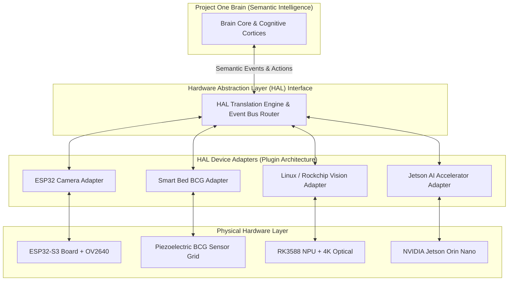

# 📜 RFC-0040 — HARDWARE ABSTRACTION LAYER (HAL) OVERVIEW
**Category**: Standards Track  
**HAL Version**: 1.0  
**Status**: Specification Standard  
**Target Horizon**: 2026 – 2050  

---

## 1. EXECUTIVE SUMMARY & ABSTRACT

**RFC-0040** specifies the **Hardware Abstraction Layer (HAL)** for Project One. The HAL acts as a permanent architectural firewall isolating the **Companion Cognitive Architecture (Brain)** from all physical hardware implementations, chipsets (ESP32, Rockchip, Qualcomm, Jetson), and operating systems (Linux, Android, FreeRTOS).

The Brain never executes direct hardware API calls (`read_gpio()`, `v4l2_capture()`, `i2c_read()`). Instead, physical hardware drivers bind to **HAL Adapters**, translating raw signals into standardized semantic PDP events (`pet.anxiety.detected`, `pet.respiration.rate`) and executing abstract semantic actions.

---

## 2. HIGH-LEVEL ARCHITECTURE MAP

---

## 3. 🔒 PATENT CANDIDATE PO-PAT-HAL-001

- **Title**: Dynamic Hardware Abstraction Layer for Real-Time Multi-Modal Biometric Telemetry Systems.
- **Problem**: Changing physical hardware, chipsets, or drivers breaks higher-level AI cognitive algorithms in IoT systems.
- **Innovation**: A bi-directional hardware abstraction barrier converting multi-modal physical sensor signals (BCG, optical keypoints, acoustic decibels) into standardized semantic event streams without Brain recompilation.
- **Claims**: A method for isolating cognitive neural cortices from physical hardware sensors.
