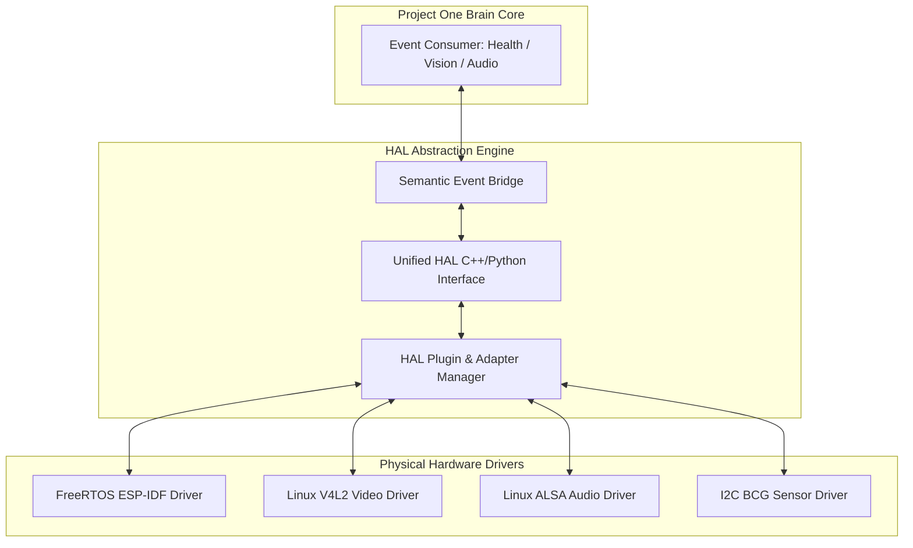

# 🏛️ RFC-0041 — HAL ARCHITECTURE & PLUGIN INFRASTRUCTURE
**Category**: Standards Track  
**HAL Version**: 1.0  

---

## 1. HAL STACK LAYERING

---

## 2. 🔒 PATENT CANDIDATE PO-PAT-HAL-002

- **Title**: Dynamic Plugin Infrastructure for Zero-Downtime Hot-Swappable Bio-Sensor Adapters.
- **Problem**: Adding new sensor drivers requires restarting the central monitoring system, causing unmonitored periods.
- **Innovation**: Hot-pluggable C++/Python HAL adapter manager that registers novel hardware drivers dynamically without interrupting active digital twin streams.
- **Claims**: A system for zero-downtime hot-swapping of bio-sensory hardware drivers.
