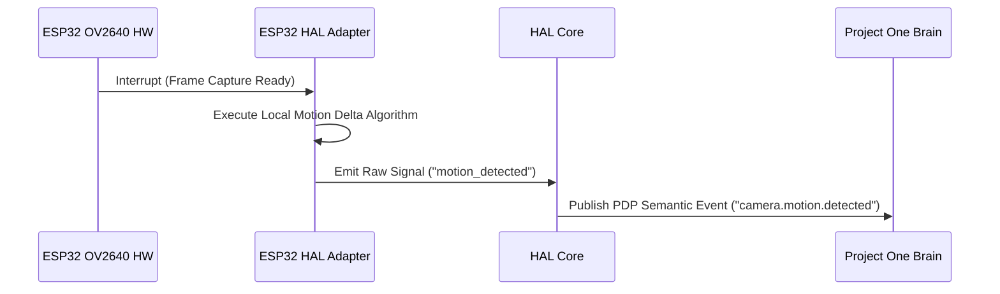

# 🔌 RFC-0042 — HAL DEVICE ADAPTERS SPECIFICATION
**Category**: Standards Track  
**HAL Version**: 1.0  

---

## 1. DEVICE ADAPTER SPECIFICATION

A **HAL Device Adapter** is a software component implementing the standard HAL interface for a specific physical device model. Adding support for new hardware requires writing a HAL Adapter—**zero changes to the Brain Core**.

### ESP32 Camera Adapter Sequence:

---

## 2. 🔒 PATENT CANDIDATE PO-PAT-HAL-003

- **Title**: Standalone Semantic Adapter Pipeline for Microcontroller Vision Hardware.
- **Problem**: Microcontrollers lack computing power to run complex LLMs, requiring high-bandwidth raw streaming.
- **Innovation**: Lightweight HAL adapters executing local frame-difference algorithms to emit compact semantic event triggers instead of continuous video.
- **Claims**: A method for lightweight semantic event generation on constrained microcontrollers.
