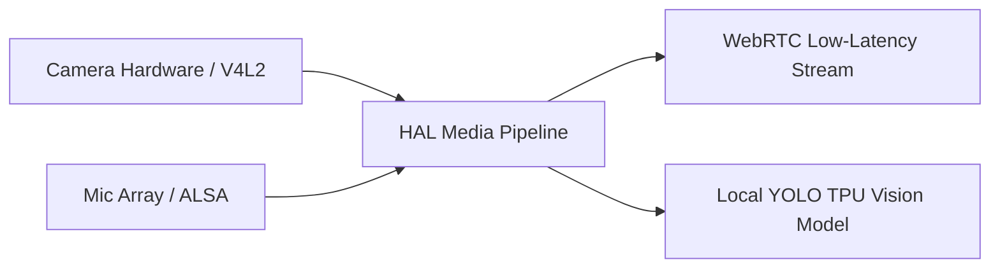

# 📹 RFC-0044 — HAL MEDIA ABSTRACTION SPECIFICATION
**Category**: Standards Track  
**HAL Version**: 1.0  

---

## 1. MEDIA STREAMING & AUDIO/VIDEO ABSTRACTION

HAL provides abstract media pipelines (`hal.media.video_stream`, `hal.media.audio_input`, `hal.media.audio_output`) isolating V4L2/ALSA/Android Camera2 hardware drivers from WebRTC and AI Vision processing pipelines.

---

## 2. 🔒 PATENT CANDIDATE PO-PAT-HAL-005

- **Title**: Dual-Path Hardware-Accelerated Media Abstraction Engine for Simultaneous Vision AI & WebRTC Streaming.
- **Problem**: Accessing camera hardware buffers simultaneously for WebRTC video and local AI pose inference causes driver locking.
- **Innovation**: A zero-copy HAL media buffer splitter feeding optical frames to edge neural TPUs and WebRTC encoders concurrently.
- **Claims**: A method for zero-copy media frame splitting between neural vision models and streaming WebRTC encoders.
