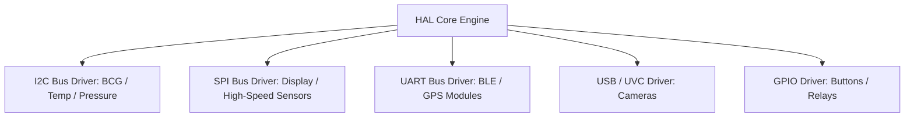

# 🛠️ RFC-0046 — HAL DRIVERS ARCHITECTURE SPECIFICATION
**Category**: Standards Track  
**HAL Version**: 1.0  

---

## 1. DRIVER INTERFACE ARCHITECTURE

HAL Drivers communicate with physical hardware interfaces across standard buses:

---

## 2. 🔒 PATENT CANDIDATE PO-PAT-HAL-007

- **Title**: Unified Microcontroller & Linux Kernel User-Space Hardware Bus Abstraction Framework.
- **Problem**: Porting driver logic between bare-metal FreeRTOS (ESP32) and Linux user-space (Raspberry Pi/Rockchip).
- **Innovation**: A unified C++ HAL driver template operating transparently over FreeRTOS hardware registers and Linux `/dev/i2c`, `/dev/spidev` interfaces.
- **Claims**: A cross-platform bus abstraction framework for embedded bio-monitors.
