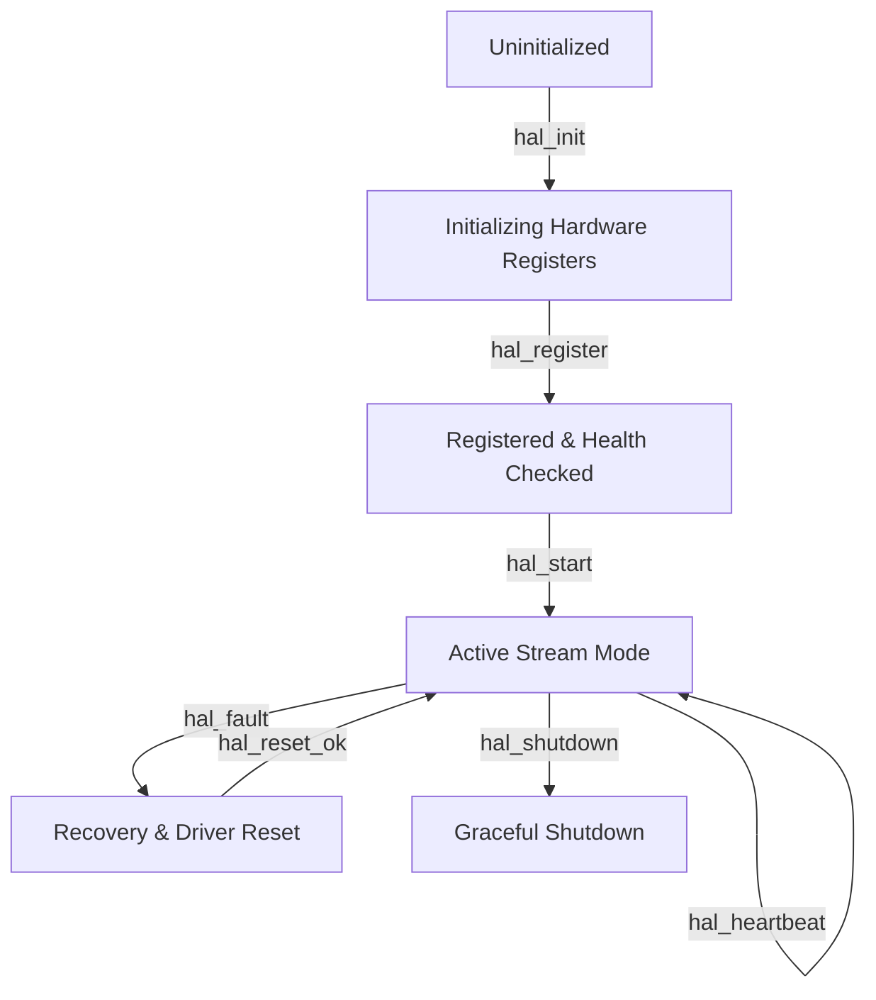

# 🔄 RFC-0047 — HAL DRIVER LIFECYCLE SPECIFICATION
**Category**: Standards Track  
**HAL Version**: 1.0  

---

## 1. DRIVER LIFECYCLE STATE MACHINE

---

## 2. 🔒 PATENT CANDIDATE PO-PAT-HAL-008

- **Title**: Self-Healing Hardware Driver Lifecycle Manager with Automated Register Recovery.
- **Problem**: I2C bus lockups or transient electrical interference causing permanent sensor driver failure.
- **Innovation**: Automated HAL driver lifecycle monitoring executing low-level bus reset sequences without system reboot upon detecting heartbeat loss.
- **Claims**: A method for automated self-healing of embedded bio-sensor hardware drivers.
