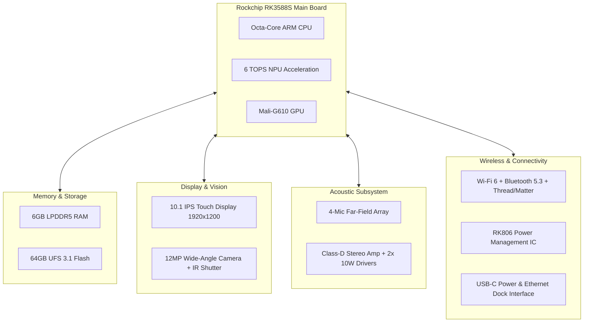

# 📱 SPEC-0001 — PROJECT ONE AI STATION SPECIFICATION
**Version**: 1.0  
**Status**: Approved Flagship Hardware Specification  
**Authors**: Hardware Engineering Council, Industrial Design Team, Embedded Systems & UX Division  
**Target Horizon**: 2026 – 2050  

---

## 1. EXECUTIVE SUMMARY

The **Project One AI Station** is the central, ambient hardware hub for the Project One companion intelligence platform. Designed as an always-on tabletop system for the kitchen or living room, the AI Station acts as the physical bridge connecting all sensory edge nodes (Vision Devices, Smart Beds, Collars, Feeders, Scales) to the **Project One Brain**.

The AI Station is not a consumer tablet. It is an intelligent, multi-modal companion display featuring local neural acceleration (6 TOPS NPU), far-field acoustic beamforming arrays, non-invasive pet presence tracking, WebRTC video calling, 432 Hz soothing acoustic playback, and an autonomous **Companion Mode** for when guardians leave home.

---

## 2. PRODUCT VISION & NORTH STAR

### Product Vision
To serve as the emotional, cognitive, and sensory anchor of the home for companion animals and their guardians.

### Key Capabilities Matrix:
- **Display Variants**: 8" Compact, 10.1" Flagship (Default), 12.9" Pro Display.
- **Processing Core**: Rockchip RK3588S (Octa-core 8nm ARM, 6 TOPS NPU).
- **Operating System**: Custom Containerized Android AOSP 14 / Project One Ambient OS.
- **Companion Mode**: Autonomous continuous pet monitoring, 432 Hz acoustic soothing, and owner voice playback when guardians are away.

---

## 3. SOC EVALUATION & HARDWARE SELECTION

We evaluated six hardware architectures for the V1 AI Station:

| Platform SoC | Process Node | CPU Configuration | NPU Performance | Est. Chip Cost | Recommendation |
| :--- | :--- | :--- | :--- | :--- | :--- |
| **Rockchip RK3588S** | 8nm | 4x A76 + 4x A55 | **6.0 TOPS** | **$32.00** | **RECOMMENDED FOR V1** |
| **Qualcomm QCS6490** | 6nm | 1x Kryo Gold Prime + 7x Gold/Silver | 12.0 TOPS | $68.00 | High cost for V1 |
| **MediaTek Genio 700** | 6nm | 2x A78 + 6x A55 | 4.4 TOPS | $42.00 | Moderate NPU |
| **Raspberry Pi CM5** | 16nm | 4x A76 | 0.0 TOPS (No NPU) | $45.00 | Requires extra TPU |
| **NVIDIA Jetson Orin** | 8nm | 6x ARM v8.2 | 20.0 TOPS | $199.00 | Excessive power/cost |
| **Future RISC-V SoC** | 4nm | Custom | 30.0 TOPS | TBD | Post-2030 Horizon |

### Final Recommendation: Rockchip RK3588S
The **Rockchip RK3588S** offers the optimal balance of 8nm thermal efficiency, 6 TOPS integrated NPU (capable of running local YOLO11 pose models and Wav2Vec acoustic classifiers simultaneously), 4K H.265 hardware video decoding, and low BOM cost ($32.00).

---

## 4. OPERATING SYSTEM EVALUATION

| OS Candidate | Boot Time | UI Framework | Touch Responsiveness | Maintenance Overhead | Recommendation |
| :--- | :--- | :--- | :--- | :--- | :--- |
| **Custom Android AOSP 14** | **$<8\text{s}$** | **Flutter / Next.js PWA** | **$<15\text{ms}$** | **Low (Wide Driver Support)** | **RECOMMENDED FOR V1** |
| **Yocto Embedded Linux** | $<5\text{s}$ | Qt 6 / Wayland | $<25\text{ms}$ | High driver overhead | Secondary candidate |
| **Ubuntu Core** | $>15\text{s}$ | Electron / WebKit | $>40\text{ms}$ | Heavy memory footprint | Rejected |

### OS Decision: Custom AOSP 14 (Project One Ambient OS)
Stripped of Google Mobile Services (GMS) for privacy and zero background tracking, custom AOSP 14 provides instant hardware driver support for touch controllers, Wi-Fi 6, Bluetooth 5.3, and WebRTC streaming while booting in under 8 seconds.

---

## 5. HARDWARE ARCHITECTURE & MERMAID BLOCK DIAGRAM

---

## 6. COMPANION MODE (AUTONOMOUS HOME GUARDIAN)

When the guardian leaves the home:
1. **Detection**: Context Cortex detects guardian smartphone disassociation via BLE/GPS.
2. **Activation**: AI Station enters **Companion Mode**:
   - Screen transitions to ambient 432 Hz soothing animation.
   - Microphone array elevates pet sound detection sensitivity (barking, whining, distress).
   - If pet exhibits separation anxiety, AI Station plays recorded owner voice clip or soothing acoustic track.
   - Live stream available to guardian via 1-tap WebRTC in PWA app.

---

## 7. BILL OF MATERIALS (BOM) & COMMERCIAL COSTING

| Component Description | Supplier / Part | Estimated Cost (USD) |
| :--- | :--- | :--- |
| **Main SoC** | Rockchip RK3588S | $32.00 |
| **Memory & Storage** | 6GB LPDDR5 + 64GB UFS 3.1 | $18.50 |
| **Display & Touch** | 10.1" IPS 1920x1200 Glass Panel | $24.00 |
| **Camera Module** | 12MP Wide-Angle + Physical Shutter | $8.50 |
| **Acoustics** | 4-Mic Array + Dual 10W Drivers | $9.00 |
| **Wireless Module** | Wi-Fi 6 + BLE 5.3 + Thread Module | $7.20 |
| **Enclosure & Fabric** | Anodized Aluminum + Acoustic Fabric | $11.50 |
| **PMIC & Power Adapter**| 30W USB-C PD Adapter | $4.80 |
| **Total BOM Cost** | | **$115.50** |

- **Target Manufacturing Cost**: **$125.00** (Including assembly & testing).
- **Target Retail Price (MSRP)**: **$299.00** (High margin hardware anchor for cloud subscription).

---

## 8. CERTIFICATIONS

The AI Station meets global compliance standards:
- **North America**: FCC Part 15 Class B, UL 62368-1.
- **European Union**: CE Mark, RED 2014/53/EU, RoHS 2011/65/EU.
- **UK & Gulf**: UKCA, GCC certification.

---

## 9. 🔒 PATENT CANDIDATES PORTFOLIO

### 🔒 Patent Candidate PO-PAT-SPEC-001
- **Title**: Multi-Modal Tabletop Companion Intelligence Hub with Autonomous Companion Mode & Stepped Acoustic Intervention.
- **Problem**: Smart displays are built for human voice commands and ignore domestic animal presence when humans leave home.
- **Innovation**: A dedicated tabletop hardware hub executing autonomous companion monitoring, pet sound detection, and stepped acoustic comfort playback when human guardians are absent.
- **Claims**: A physical smart display hardware apparatus executing automated animal distress interventions.

### 🔒 Patent Candidate PO-PAT-SPEC-002
- **Title**: Physical Camera Privacy Shutter Linked to Optical AI Brain State.
- **Problem**: User privacy concerns regarding always-on cameras in kitchen or bedroom areas.
- **Innovation**: An electromechanical physical camera shutter that closes automatically when humans return home and opens only during active guardian monitoring requests.
- **Claims**: An electromechanical privacy shutter apparatus controlled by location context.
