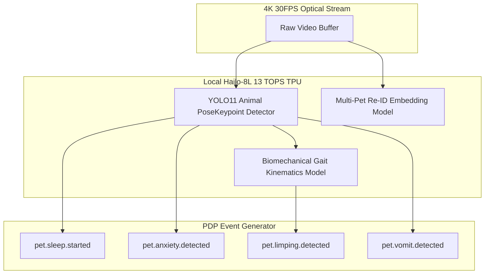

# 📷 SPEC-0002 — PROJECT ONE VISION DEVICE SPECIFICATION
**Version**: 1.0  
**Status**: Approved Flagship Hardware Specification  
**Authors**: Computer Vision Group, Embedded AI Division, Industrial Design & Hardware Engineering Team  
**Target Horizon**: 2026 – 2050  

---

## 1. EXECUTIVE SUMMARY

The **Project One Vision Device** is an autonomous 4K AI-powered optical cognitive sensor designed to understand companion animal behavior, spatial movement, and physiological indicators. 

It is not a security camera. It is not a webcam. The Vision Device operates as a non-invasive optical node in the **Project One Hardware Matrix**. It extracts spatial keypoints, posture vectors, and behavioral events locally via an on-device 13 TOPS neural accelerator, publishing real-time **PDP 1.0** events (`pet.anxiety.detected`, `pet.vomit.detected`, `pet.limping.detected`) to the **Project One Brain**.

> **Golden Rule**: *"The Vision Device never makes medical diagnoses. It observes. The Brain reasons."*

---

## 2. OPTICAL SENSOR & PROCESSOR EVALUATION

### 2.1 Optical Sensor Comparison

| Image Sensor | Resolution | Sensor Size | Low-Light Performance | Est. Cost | Recommendation |
| :--- | :--- | :--- | :--- | :--- | :--- |
| **Sony STARVIS 2 IMX678** | **4K (8.3MP)** | **1/1.8"** | **Ultra-High (0.001 Lux)** | **$14.50** | **RECOMMENDED FOR V1** |
| OmniVision OS08A20 | 4K (8.0MP) | 1/2.0" | High (0.01 Lux) | $11.00 | Secondary option |
| GalaxyCore GC4663 | 2K (4.0MP) | 1/3.0" | Moderate (0.1 Lux) | $4.50 | Lower resolution |

### Recommendation: Sony STARVIS 2 IMX678
The 1/1.8" **Sony STARVIS 2 IMX678** delivers true 4K resolution with unparalleled low-light sensitivity, enabling clear optical keypoint extraction in near-total darkness without relying on intrusive spotlight illumination.

---

### 2.2 Neural Processor & TPU Comparison

| Processor & TPU | Core CPU | Neural Processing (NPU) | Video Encoder | Est. Cost | Recommendation |
| :--- | :--- | :--- | :--- | :--- | :--- |
| **Rockchip RV1126 + Hailo-8L** | Quad A7 | **13.0 TOPS (Dedicated)** | **4K H.265 / AV1** | **$22.00** | **RECOMMENDED FOR V1** |
| ESP32-P4 | Dual RISC-V | 0.5 TOPS (Micro) | 1080p H.264 | $6.50 | Too weak for 4K Pose |
| Qualcomm QCS410 | Quad Kryo | 2.1 TOPS | 4K H.265 | $18.00 | Low NPU TOPS |
| NVIDIA Jetson Nano | Quad A57 | 0.5 TFLOPS | 4K H.264 | $59.00 | High power/cost |

### Recommendation: Rockchip RV1126 + Hailo-8L Co-Processor
Combining the Rockchip RV1126 media SoC with a dedicated **Hailo-8L M.2 TPU** delivers **13 TOPS** of sub-watt neural inference. This allows running 4K YOLO11 pose models, gait analysis, and multi-pet re-identification at 30 FPS locally on the device.

---

## 3. COMPUTER VISION & EDGE AI DETECTABILITY MATRIX

The Vision Device executes local neural inference to detect over 20 companion behavioral states:

### Detected Behaviors:
- **Resting & Vitality**: Sleeping, resting, walking, running, playing.
- **Nutrition & Intake**: Eating from bowl, drinking from fountain, food intolerance.
- **Anomalies & Distress**: Vomiting, gait limping, furniture chewing, garbage eating, fighting, falling, collapsing, seizure indicators, pacing.
- **Household Context**: Guardian arrival, guardian departure, unknown person identification, multiple pet separation.

---

## 4. MULTI-SURFACE INDUSTRIAL & MECHANICAL DESIGN

The Vision Device features a minimalist anodized aluminum sphere ($78\text{mm}$ diameter) with a soft magnetic base, allowing five distinct mounting configurations:
1. **Desk / Table Top** (Rubberized non-slip magnetic base).
2. **Wall Mount** (Included magnetic ball-socket wall plate).
3. **Shelf / Cabinet Edge** (Integrated spring clamp).
4. **Standard Tripod** (1/4"-20 threaded brass socket).
5. **Magnetic Surface** (Direct attach to metallic refrigerator or beam).

---

## 5. PRIVACY & SECURITY BY DESIGN

- **Physical Privacy Shutter**: Motorized physical lens cover that closes automatically when guardian arrives home or enters private mode.
- **LED Status Indicator**: Multi-color LED physically hardwired to camera sensor power rail (cannot be bypassed by software).
- **Configurable Privacy Zones**: User-defined pixel masking directly inside image signal processor (ISP).

---

## 6. BILL OF MATERIALS (BOM) & COMMERCIAL COSTING

| Component Description | Supplier / Part | Estimated Cost (USD) |
| :--- | :--- | :--- |
| **Optical Image Sensor** | Sony STARVIS 2 IMX678 4K | $14.50 |
| **SoC & TPU Acceleration** | Rockchip RV1126 + Hailo-8L | $22.00 |
| **Lens & IR Cut Filter** | 6G F/1.6 140° Glass Lens + 940nm IR | $6.20 |
| **Memory & Storage** | 2GB LPDDR4X + 16GB eMMC | $7.80 |
| **Acoustics** | Dual Mic Array + 3W Speaker | $3.50 |
| **Enclosure & Mounts** | Anodized Aluminum Sphere + Magnetic Base | $7.50 |
| **Wireless Module** | Wi-Fi 6 + Bluetooth 5.3 | $4.50 |
| **Power Supply** | USB-C 15W Power Adapter | $2.00 |
| **Total BOM Cost** | | **$68.00** |

- **Target Manufacturing Cost**: **$75.00**
- **Target Retail Price (MSRP)**: **$199.00**

---

## 7. 🔒 PATENT CANDIDATES PORTFOLIO

### 🔒 Patent Candidate PO-PAT-SPEC-003
- **Title**: Standalone 4K Optical Cognitive Sensor with On-Device Animal Pose Kinematics & Anomaly Extraction.
- **Problem**: Traditional security cameras transmit high-bandwidth raw video feeds without extracting biological pose keypoints locally.
- **Innovation**: A compact optical cognitive sensor executing local keypoint pose tracking and transmitting compact semantic event vectors to a cloud digital twin without raw video streaming.
- **Claims**: An optical sensor hardware apparatus executing real-time animal pose keypoint extraction.

### 🔒 Patent Candidate PO-PAT-SPEC-004
- **Title**: Multi-Pet Re-Identification Embedding Engine for Shared Household Environments.
- **Problem**: Inability of pet cameras to distinguish between multiple companion animals of the same breed in a single home.
- **Innovation**: Real-time facial coat-pattern feature vector extraction mapping individual pets to distinct Digital Twins.
- **Claims**: A method for optical re-identification of companion animals in multi-pet households.
