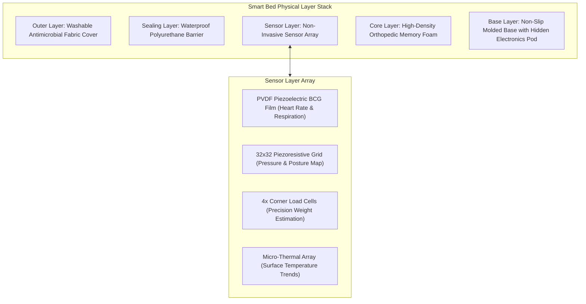

# 🛏️ SPEC-0003 — PROJECT ONE SMART BED SPECIFICATION
**Version**: 1.0  
**Status**: Approved Flagship Hardware Specification  
**Authors**: Biomedical Engineering Group, Embedded AI Division, Veterinary Advisory Council, Industrial Design Team  
**Target Horizon**: 2026 – 2050  

---

## 1. EXECUTIVE SUMMARY

The **Project One Smart Bed** is an invisible, non-invasive physiological sensing platform for companion animals. Disguised as a premium orthopedic memory foam bed, it requires zero wearables, zero collars, and zero user interaction. The companion simply sleeps.

Integrated beneath its washable outer cover lies a non-invasive biomedical sensor matrix: **PVDF Ballistocardiography (BCG) film**, a $32 \times 32$ piezoresistive pressure grid, precision corner load cells, and a micro-thermal array. The Smart Bed extracts micro-mechanical heart impulses, respiration waveforms, resting weight trajectories, sleep REM cycles, and restless pain indicators continuously, transmitting structured **PDP 1.0** events (`pet.sleep.started`, `pet.respiration.rate`, `pet.heart_rate.bpm`) to the **Project One Brain**.

> **Golden Directive**: *"Do not design a bed. Design an invisible health laboratory."*

---

## 2. BIOMEDICAL SENSOR MATRIX ARCHITECTURE

---

## 3. NON-INVASIVE MEASUREMENT CAPABILITIES

### 3.1 Ballistocardiography (BCG) Micro-Impulse Sensing
BCG measures the mechanical recoil of the animal's body caused by the ejection of blood from the heart ventricles during cardiac contraction:

$$\text{BCG Waveform}(t) = f(\text{Cardiac Contraction}) + f(\text{Diaphragm Respiration}) + \epsilon_{\text{movement}}$$

The local **ESP32-S3 dual-core MCU** filters out movement artifacts ($\epsilon_{\text{movement}}$) using digital bandpass FIR filters ($0.5 - 3.5\text{ Hz}$ for heart rate, $0.1 - 0.8\text{ Hz}$ for respiration), deriving resting heart rate (BPM) and respiration rates without physical skin contact.

### 3.2 Detection Matrix
- **Vital Biometrics**: Resting Heart Rate (BPM), Respiration Rate (BPM), Heart Rate Variability (HRV).
- **Physical States**: Bed Occupancy, Posture Mapping (Curled vs. Stretched), Weight Estimation ($\pm 50\text{g}$).
- **Sleep Architecture**: Sleep Staging (Light, Deep REM, Restless), Sleep Duration, Sleep Score ($0 - 100$).
- **Health Indicators**: Pain/Stiffness Index (Gait/turnover latency upon wake-up), Dehydration Risk, Vitality Score.

---

## 4. INDUSTRIAL & MECHANICAL ENGINEERING

- **Washable Outer Cover**: Removable, machine-washable antimicrobial woven organic cotton with a hidden child-safe zipper.
- **Hermetic Electronic Pod**: Embedded IP67 waterproof polycarbonate shell housing the electronics and battery back-up, hidden completely inside the lower foam cavity.
- **Zero Cable Exposure**: Power supplied via standard braided nylon USB-C magnetic breakaway cable.

---

## 5. EDGE VS. CLOUD AI PIPELINE

---

## 6. BILL OF MATERIALS (BOM) & COMMERCIAL COSTING

| Component Description | Supplier / Part | Estimated Cost (USD) |
| :--- | :--- | :--- |
| **BCG Piezoelectric PVDF Sensor Film** | TE Connectivity / Custom Matrix | $9.50 |
| **Piezoresistive Pressure Grid** | 32x32 Custom Film Matrix | $8.00 |
| **Load Cell Array** | 4x Micro Load Cell Strain Gauges | $5.20 |
| **Microcontroller & MCU** | ESP32-S3 Dual-Core Wi-Fi/BLE | $3.50 |
| **Orthopedic Foam Core** | High-Density Viscoelastic Memory Foam | $14.00 |
| **Cover & Seals** | Washable Fabric Cover + IP67 Waterproof Barrier | $7.80 |
| **Power & Cabling** | USB-C Magnetic Breakaway Cable + PMIC | $4.00 |
| **Total BOM Cost** | | **$52.00** |

- **Target Manufacturing Cost**: **$58.00**
- **Target Retail Price (MSRP)**: **$179.00**

---

## 7. 🔒 PATENT CANDIDATES PORTFOLIO

### 🔒 Patent Candidate PO-PAT-SPEC-005
- **Title**: Non-Invasive Ballistocardiography & Piezoresistive Pressure Sensing System for Domestic Animal Health Monitoring.
- **Problem**: Inability to continuously monitor animal heart rate and respiration without invasive collars or skin-attached sensors.
- **Innovation**: Sub-foam PVDF piezoelectric film combined with a piezoresistive pressure grid extracting cardiac BCG recoil waves and respiration through heavy pet fur and memory foam.
- **Claims**: A non-invasive physiological sensing apparatus embedded in a pet resting platform.

### 🔒 Patent Candidate PO-PAT-SPEC-006
- **Title**: Automated Musculoskeletal Stiffness Index Estimation via Sleeping Turnover Kinematics.
- **Problem**: Early detection of canine osteoarthritis requires subjective clinical observation during vet visits.
- **Innovation**: Calculating a quantitative musculoskeletal stiffness score by measuring turnover latency and pressure redistribution time during wake-up transitions.
- **Claims**: A method for detecting animal joint stiffness via pressure grid turnover dynamics.
