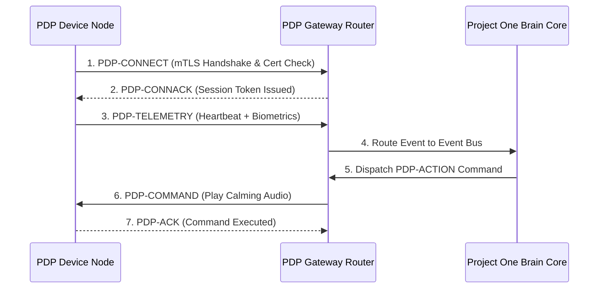

# 🏛️ RFC-0002 — PDP ARCHITECTURE & STACK LAYERING
**Category**: Standards Track  
**Protocol Version**: 1.0  
**Status**: Specification Standard  

---

## 1. PROTOCOL STACK LAYERING

PDP is structured into five distinct operational layers:

```
┌─────────────────────────────────────────────────────────────┐
│                 APPLICATION & COGNITIVE LAYER               │
│       Semantic Events (pet.sleep, pet.anxiety, pet.food)    │
├─────────────────────────────────────────────────────────────┤
│                 PRESENTATION & SCHEMA LAYER                 │
│         Pet Description Language (PDL JSON / CBOR)          │
├─────────────────────────────────────────────────────────────┤
│                 SESSION & SECURITY LAYER                    │
│        mTLS 1.3 / Certificate Rotation / Nonce Replay       │
├─────────────────────────────────────────────────────────────┤
│                 TRANSPORT BUS LAYER                         │
│        WebSockets (WSS) / WebRTC / MQTT / CoAP              │
├─────────────────────────────────────────────────────────────┤
│                 NETWORK & LINK LAYER                        │
│          IPv6 / IPv4 / Wi-Fi 6 / Bluetooth 5.3 / Thread     │
└─────────────────────────────────────────────────────────────┘
```

---

## 2. SEQUENCE & STATE MACHINE DIAGRAM



---

## 3. 🔒 PATENT CANDIDATE PO-PAT-PDP-002

- **Title**: Unified Dynamic Transport-Agnostic Session State Machine for Constrained Biometric Nodes.
- **Problem**: Disconnects between BLE, Wi-Fi, and Thread cause broken state machines on low-power bio-telemetry nodes.
- **Innovation**: A transport-agnostic session abstraction layer maintaining continuous PDP connection state across physical network handoffs.
- **Claims**: A system for maintaining persistent cryptographic session continuity across heterogeneous link layers.
