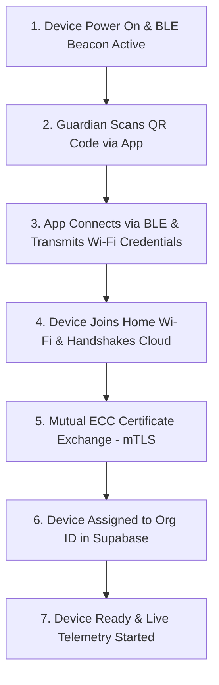

# 🤝 RFC-0004 — PDP SECURE PAIRING SPECIFICATION
**Category**: Standards Track  
**Protocol Version**: 1.0  

---

## 1. SECURE PAIRING FLOW (< 2 MINUTES)



---

## 2. QR CODE DATA PAYLOAD STANDARD

```text
PDP:v1.0|id:dev_cam_8f42|model:P1-CAM-4K|pk:04a1b2c3d4...|setup:ble
```

---

## 3. 🔒 PATENT CANDIDATE PO-PAT-PDP-004

- **Title**: Zero-Configuration Cryptographic Pairing & Mutual Certificate Exchange Protocol for Animal Monitoring Sensors.
- **Problem**: Non-technical pet owners struggle with complex IoT pairing procedures.
- **Innovation**: Single-scan QR token exchange initiating automated BLE provisioning and background mTLS X.509 certificate generation in $< 120\text{ seconds}$.
- **Claims**: A method for zero-touch cryptographic pairing of consumer bio-telemetry devices.
