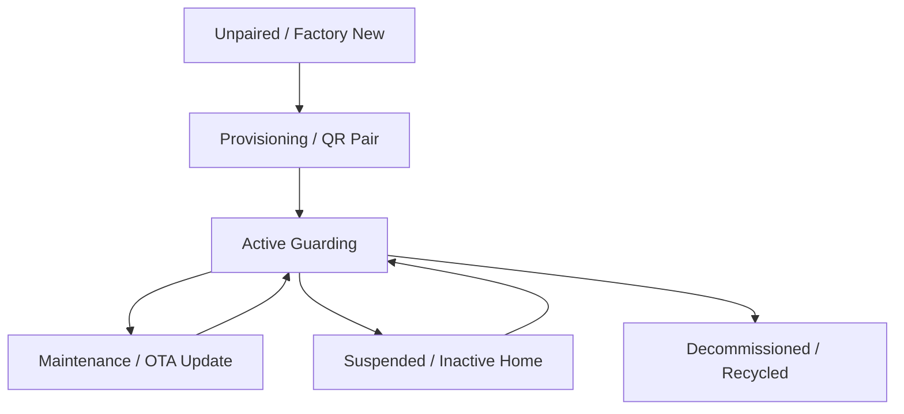

# 🔄 RFC-0011 — PDP DEVICE LIFECYCLE SPECIFICATION
**Category**: Standards Track  
**Protocol Version**: 1.0  

---

## 1. DEVICE LIFECYCLE STATES

---

## 2. 🔒 PATENT CANDIDATE PO-PAT-PDP-011

- **Title**: Secure Hardware Decommissioning & Cryptographic Disassociation Protocol for Domestic Sensor Nodes.
- **Problem**: Resold or recycled smart pet devices retaining previous owner data or private stream tokens.
- **Innovation**: Instant cryptographic purge of local memory keys and certificate revoke upon hardware disassociation.
- **Claims**: A method for cryptographic wipe during hardware ownership transfer.
