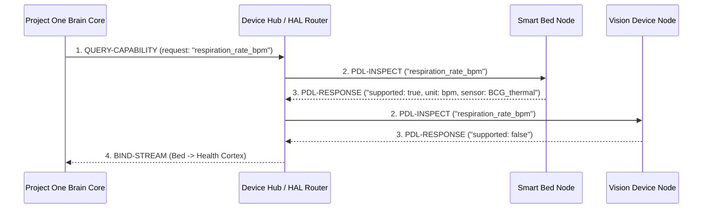

# 📜 RFC-0020 — PET DESCRIPTION LANGUAGE (PDL) OVERVIEW
**Category**: Standards Track  
**Language Version**: 1.0  
**Status**: Specification Standard  
**Target Horizon**: 2026 – 2050  

---

## 1. EXECUTIVE SUMMARY & ABSTRACT

**RFC-0020** specifies the **Pet Description Language (PDL)**. PDL is a machine-readable, semantic capability description language that enables any hardware sensor node to self-describe its sensors, actuators, edge AI models, power state, and supported biological events to the **Project One Brain**.

PDL acts as the "HTML for hardware" or "USB Descriptors for Intelligent Companion Devices". Rather than hardcoding device driver behaviors, the Project One Brain never queries *"What brand/model device are you?"*, but instead queries *"What capabilities can you provide to the companion digital twin?"*

---

## 2. THE CAPABILITY NEGOTIATION PATTERN

---

## 3. 🔒 PATENT CANDIDATE PO-PAT-PDL-001

- **Title**: Semantic Capability Self-Description & Dynamic Query Negotiation Protocol for Animal Monitoring Hardware.
- **Problem**: Monolithic driver models require custom code updates every time a manufacturer releases a new pet sensor model.
- **Innovation**: A self-describing capability descriptor language (PDL) allowing AI cognitive cortices to dynamically discover and bind novel sensory features without driver updates.
- **Claims**: A method for dynamic capability discovery and stream binding in non-human animal bio-monitoring systems.
