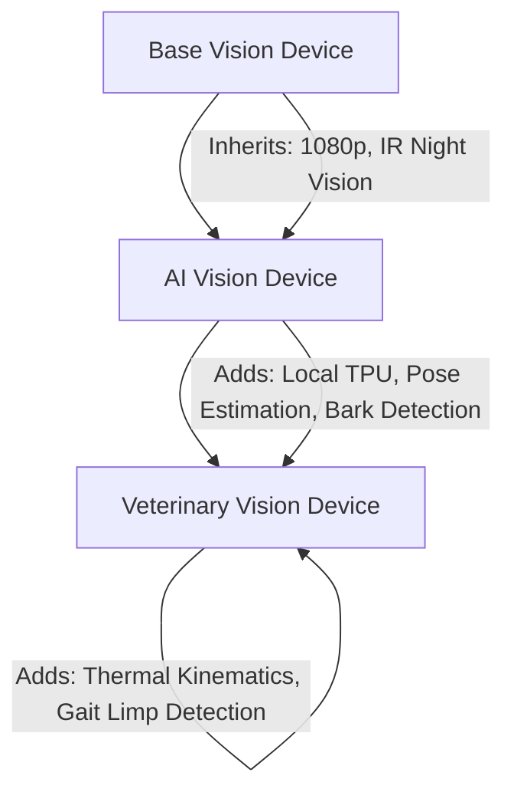

# 🏗️ RFC-0022 — PDL CAPABILITY INHERITANCE & TYPING SPECIFICATION
**Category**: Standards Track  
**Language Version**: 1.0  

---

## 1. CAPABILITY INHERITANCE HIERARCHY

PDL supports object-oriented semantic inheritance for device capability profiles:



---

## 2. INHERITANCE DESCRIPTOR STRUCTURE

```yaml
pdl_version: "1.0"
extends: "pdl.base.vision_device"
capability_class: "pdl.vet.ai_vision_device"
additional_capabilities:
  gait_limping_analysis: true
  thermal_body_map_resolution: "0.1C"
```

---

## 3. 🔒 PATENT CANDIDATE PO-PAT-PDL-003

- **Title**: Object-Oriented Semantic Capability Inheritance Framework for Animal Sensor Devices.
- **Problem**: Inability of IoT platforms to extend baseline camera or bed capabilities with specialized veterinary sensors without breaking base interface contracts.
- **Innovation**: A polymorphic inheritance descriptor tree permitting specialized veterinary hardware to extend baseline consumer devices seamlessly.
- **Claims**: A method for capability inheritance in animal monitoring hardware profiles.
