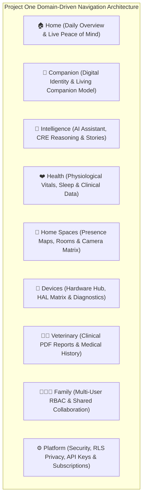
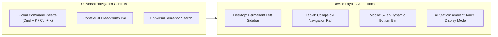

# 🎨 PO-0160 — DOMAIN-DRIVEN EXPERIENCE (DDX) SPECIFICATION
**Version**: 1.0  
**Status**: Approved Master UX/IA Specification (Refactoring 002)  
**Authors**: Human-Centered AI Division, UX Architecture Team, Enterprise Product Engineering  
**Target Horizon**: 2026 – 2050  

---

## 1. EXECUTIVE SUMMARY & BUSINESS MOTIVATION

**PO-0160** specifies the **Domain-Driven Experience (DDX)** for Project One.

As Project One reached architectural maturity across its 6 Master Pillars (Brain, Cloud, Connect, Devices, Labs, Companion Intelligence Mesh), the user interface must evolve. The navigation is no longer a collection of isolated MVP features or developer code modules. It is an enterprise **Domain-Driven Interface** organized around how guardians, veterinarians, and family members mentally conceptualize companion animal life.

This specification refactors the Information Architecture (IA) into **Nine Core Business Domains**. The visual design system (Obsidian `#07070A`, Plus Jakarta Sans typography, soft rounded-3xl cards, and health rings) remains 100% intact.

---

## 2. THE NINE CORE BUSINESS DOMAINS

---

## 3. DOMAIN SPECIFICATIONS

### 3.1 🏠 Domain 1: HOME
- **Purpose**: Real-time daily peace-of-mind summary and active companion status.
- **Core Sub-Views**: Health Score 97 Ring, Today's Story Highlight, Live Status (*"Lola • Sleeping peacefully"*), Active Alerts, Quick Action Bar (1-tap acoustic talkback, camera stream, dispense food).

---

### 3.2 🐾 Domain 2: COMPANION
- **Purpose**: The biological and cognitive digital identity of the companion animal.
- **Core Sub-Views**: Living Companion Model (LCM) [PO-0140], Cognitive DNA 128-D vector [PO-0130], Milestone Life Graph, Companion Memory Vault, Social Attachment Graph.

---

### 3.3 🧠 Domain 3: INTELLIGENCE
- **Purpose**: All cognitive outputs, inferences, and story narratives produced by the AI Brain.
- **Core Sub-Views**: Conversational AI Assistant, Evidence-First Explainability Traces [PO-0150], Daily/Weekly/Monthly/Annual Story Films, 6–12 Month Health Risk Predictions.

---

### 3.4 ❤️ Domain 4: HEALTH
- **Purpose**: Continuous physiological wellness and vital biometric evolution.
- **Core Sub-Views**: Sleep REM Architecture & BCG Vitals (Smart Bed), Hydration Intake ml/day, Caloric Intake, Respiratory Rate, Heart Rate (BPM), Weight Trajectory, Musculoskeletal Stiffness Index.

---

### 3.5 🏡 Domain 5: HOME SPACES
- **Purpose**: Spatial environment representation and presence localization.
- **Core Sub-Views**: Room Layouts, Camera Matrix View (4K Vision Devices), Presence Heatmaps, Spatial Zone Preferences, Environmental Temp/Humidity Context.

---

### 3.6 🔌 Domain 6: DEVICES
- **Purpose**: Hardware node administration and hardware abstraction management.
- **Core Sub-Views**: AI Station Hub, Vision Devices, Smart Bed, Smart Water, Smart Feeder, Smart Scale, Smart Collar, PDP 1.0 Telemetry, HAL Diagnostics, Dual-Bank A/B OTA Firmware Controls.

---

### 3.7 👨‍⚕️ Domain 7: VETERINARY
- **Purpose**: Professional clinical health records and veterinary collaboration.
- **Core Sub-Views**: Clinical PDF Exporter, Vaccination Logs, Prescribed Medication Schedules, Veterinary Appointment Records, Shared Diagnostic Evidence Graphs.

---

### 3.8 👨‍👩‍👧 Domain 8: FAMILY
- **Purpose**: Multi-user household collaboration and access control.
- **Core Sub-Views**: Guardian Roles (Primary, Secondary, Family, Pet Sitter, Dog Walker), Granular RBAC Permissions, Emergency Contacts, Shared Notification Routing.

---

### 3.9 ⚙️ Domain 9: PLATFORM
- **Purpose**: System security, privacy isolation, and organization administration.
- **Core Sub-Views**: PostgreSQL RLS Privacy Policies, Encrypted Data Export, Developer API Keys, Webhook Integrations, Cloud Subscription Plans, Security Audit Logs.

---

## 4. NAVIGATION HIERARCHY & CROSS-DEVICE PATTERNS

### Future Scalability Rule
Every new feature, tool, or hardware integration added to Project One **must belong to one of the Nine Business Domains**. Standalone top-level pages are strictly prohibited.

---

## 5. 🔒 PATENT CANDIDATES PORTFOLIO

### 🔒 Patent Candidate PO-PAT-DDX-001
- **Title**: Domain-Driven Navigation Architecture for Multi-Modal Animal Telemetry & Intelligence Platforms.
- **Problem**: Feature-oriented navigation in IoT applications creates fragmented user experiences across multi-device sensory streams.
- **Innovation**: A domain-driven information architecture organizing disparate hardware, AI reasoning, biological DNA, and veterinary data into nine business-aligned domain models.
- **Claims**: A domain-driven user interface architecture for multi-sensor animal intelligence systems.

### 🔒 Patent Candidate PO-PAT-DDX-002
- **Title**: Contextual Command Palette & Semantic Search Engine for Companion Life Systems.
- **Problem**: Finding historical telemetry events, video clips, or medical records across deep menu hierarchies.
- **Innovation**: A unified `Cmd+K` command palette indexing natural language queries (*"Show Lola's sleep graph from last week"*) directly to underlying domain endpoints.
- **Claims**: A semantic command palette system for searching animal biometric digital twins.
